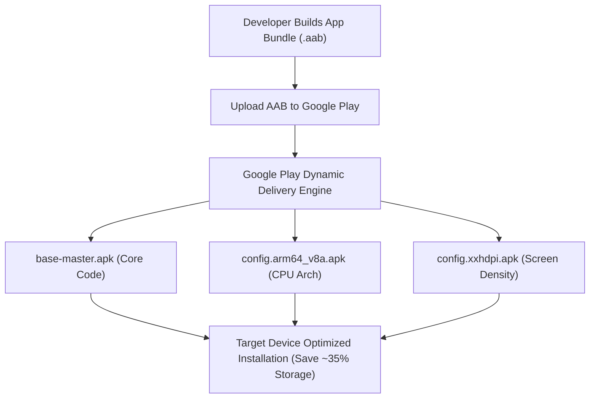

## AAB는 Play가 생성하는 APK를 위한 게시 아티팩트다

상위 문서: [릴리스 배포 계약](release-distribution-contracts.md)

### 개념 및 필요성 (What & Why)
**AAB(Android App Bundle - `.aab`)** 는 2021년부터 Google Play의 신규 앱 게시 필수가 된 표준 배포 포맷이다.
단일 대형 모놀리식 APK 파일은 모든 CPU 아키텍처(arm64-v8a, armeabi-v7a, x86_64), 모든 화면 밀도(mdpi, xhdpi, xxxhdpi), 모든 지원 언어 리소스를 몽땅 포함하고 있어 사용자 스마트폰에 불필요한 용량 낭비를 발생시킨다.
AAB는 사용자가 직접 실행하는 파일이 아닌 **Play Store 전용 게시 아티팩트(Publishing Artifact)** 이다. Google Play는 AAB를 분해하여 개별 디바이스 맞춤형 **Split APK 세트**를 동적으로 조합 및 서명 배포하여 다운로드 앱 용량을 **평균 15~35% 감축**시킨다.

### 내부 메커니즘 (Internal Mechanism)
1. **Base APK + Split APKs 구조**:
   - Base APK: 앱의 공통 바이트코드, 매니페스트, 핵심 리소스 포함.
   - Configuration Split APKs: 특정 CPU 아키텍처(`.so`), 리소스 화면 밀도, 언어 팩 전용 분할 APK.
   - Dynamic Feature Split APKs: 필요 시 온디맨드로 추가 다운로드되는 기능 모듈 APK.
2. **`bundletool` 엔진**: Google Play 내부 및 개발자 머신에서 AAB를 테스트용 `.apks` 세트로 변환하고 타깃 디바이스 사양에 맞는 맞춤 APK를 추출하는 오픈소스 도구이다.



### 코드 예시 (build.gradle.kts & bundletool)
```kotlin
// app/build.gradle.kts (AAB 번들링 활성화)
android {
    bundle {
        language {
            enableSplit = true // 언어별 Split APK 분리 활성화
        }
        density {
            enableSplit = true // 화면 밀도별 Split APK 분리 활성화
        }
        abi {
            enableSplit = true // CPU 아키텍처별 Split APK 분리 활성화
        }
    }
}
```

### 관측 가능 증거 (Observable Evidence)
AAB 파일로부터 타깃 디바이스 사양별 최적화된 APK 모음을 생성하고 용량을 관측할 수 있다:
```bash
bundletool build-apks --bundle=build/outputs/bundle/release/app-release.aab --output=output.apks
```

관련 노트: [Play app signing은 업로드 키와 앱 서명 키를 분리한다](play-app-signing-separates-upload-key-and-app-signing-key.md), [릴리스 배포 계약](release-distribution-contracts.md)
