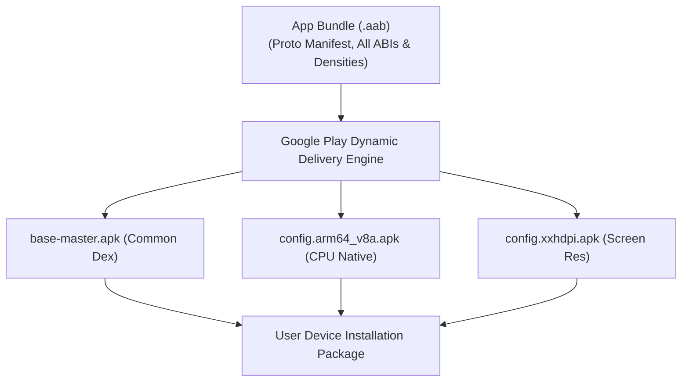

## AAB는 Play가 생성하는 APK를 위한 퍼블리싱 아티팩트다

### 내부 메커니즘 (Internal Mechanism)
**AAB (Android App Bundle, `.aab`)**는 사용자 디바이스에서 직접 인스톨되어 실행되는 바이너리 파일(APK)이 아니라, Google Play Store의 Dynamic Delivery 생성 엔진이 각 개별 기기 사양에 완전히 맞춤화된 **Split APK 세트**를 생성하기 위해 업로드받는 표준 **게시 산출물 아티팩트(Publishing Format)**다.

AAB 아티팩트 내부 구조는 단일 APK와 달리 **Protocol Buffer(프로토콜 버퍼, 효율적 직렬화 포맷)** 바이너리로 작성된 매니페스트(`AndroidManifest.pb`) 및 리소스 메타데이터 파일(`resources.pb`), 그리고 아키텍처 및 화면 밀도별 모듈 디렉토리(`base/`, `feature/`)로 체계화되어 있다.

사용자가 Google Play Store에서 앱 다운로드를 요청하면, Play 서버의 Dynamic Delivery 엔진이 요청 기기의 스펙—**CPU 아키텍처(ABI)**: `arm64-v8a`, **디스플레이 밀도(Screen Density)**: `xxhdpi`, **언어(Language)**: `ko` 등—을 즉각 분석한다. 이후 해당 기기에 전혀 불필요한 다른 CPU 라이브러리(.so) 및 고밀도/저밀도 이미지 리소스를 모두 깎아낸 **최적의 Split APK 조합 세트**만 전송함으로써 타겟 앱의 다운로드 및 설치 용량을 15%~35%까지 대폭 절감시키는 원자적 인과효과를 발휘한다.



### 코드 예시 (build.gradle.kts & BundleConfig.json)
```kotlin
// app/build.gradle.kts
android {
    bundle {
        density {
            enableSplit = true // 화면 밀도별 Split APK 생성
        }
        abi {
            enableSplit = true // CPU 아키텍처별 Split APK 생성
        }
        language {
            enableSplit = true // 언어별 Split APK 생성
        }
    }
}
```

### 관측 가능 증거 (Observable Evidence)
`bundletool` 도구를 사용하여 AAB로부터 기기별 예상 다운로드 용량(Download Size Metrics)을 산출할 수 있다:

```bash
bundletool get-size total --apks=app-release.apks --human-readable

# Output Example:
# MIN,MAX
# 14.2MB,18.5MB (Universal APK 48MB 대비 65% 용량 절감!)
```

관련 노트: [Play Delivery 계약](../play-delivery-contracts/play-delivery-contracts.md), [Play 릴리스와 배포 계약](release-distribution-contracts.md)
