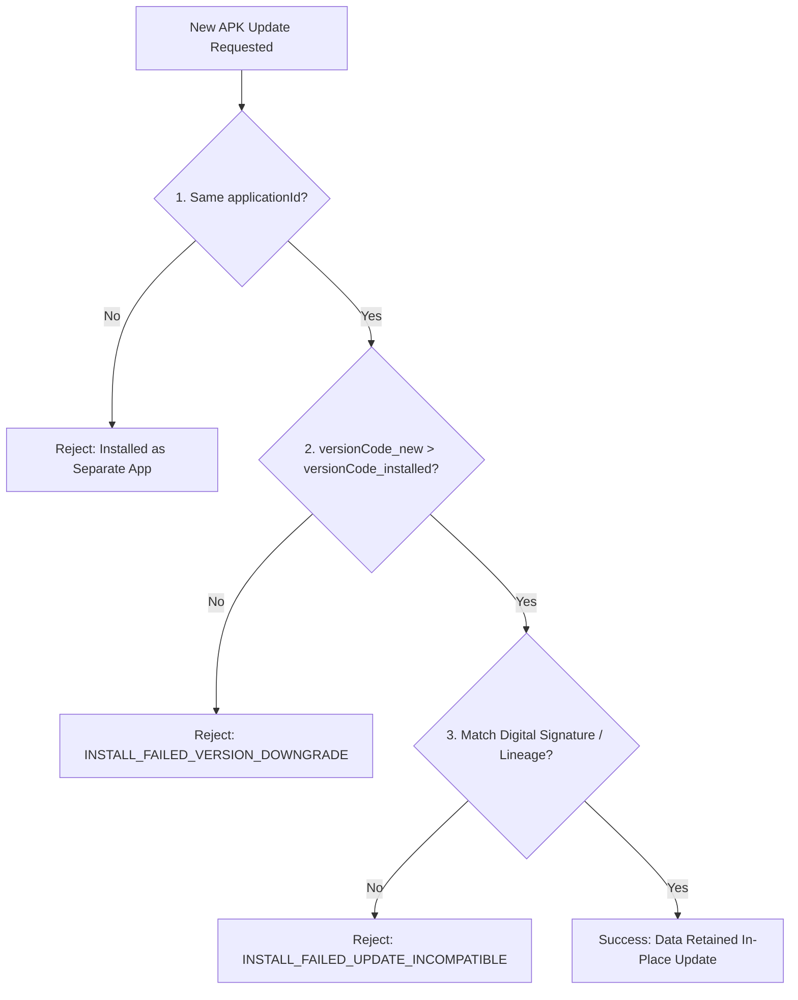

## 앱 업데이트는 applicationId, versionCode, 서명 호환성으로 결정된다

### 내부 메커니즘 (Internal Mechanism)
Android OS의 핵심 패키지 관리자인 **`PackageManager`** 서비스 및 Google Play Store 인프라가 사용자의 디바이스에 기존 로컬 데이터(DB, SharedPreferences 등)를 보존하면서 신규 덮어쓰기 업데이트(Over-the-Air Update)를 정식 허용하기 위해 검증하는 3대 절대 불변 계약:

1. **동일한 패키지 식별자 (`applicationId`)**: 신규 아티팩트의 `applicationId`가 기존 디바이스에 설치된 앱의 네임스페이스 문자열과 정확히 일치해야 한다. 다를 경우 덮어쓰기가 아닌 별개의 다른 앱으로 분리 설치된다.
2. **엄격한 버전 승급 (`versionCode`)**: 신규 앱의 `versionCode` 정수 값이 기존 설치된 앱의 `versionCode`보다 항상 엄격하게 커야 한다(`versionCode_new > versionCode_installed`). 동일하거나 낮을 경우 OS는 다운그레이드 공격 방지를 위해 `INSTALL_FAILED_VERSION_DOWNGRADE` 오류를 반환하며 설치를 거부한다.
3. **암호화 서명 호환성 (Signature Compatibility & Key Lineage)**: 신규 APK가 기존 앱과 동일한 공개키/개인키 쌍으로 디지털 서명되었거나, **APK Signature Scheme v3**에 명시된 암호학적 정식 키 계보(**Key Lineage**) 검증을 통과해야 한다. 서명이 다르면 OS 커널 및 PackageManager는 타인의 악의적 앱 덮어쓰기로 간주하여 `INSTALL_FAILED_UPDATE_INCOMPATIBLE` 오류로 차단한다.



### 코드 예시 (build.gradle.kts Version Strategy)
```kotlin
// app/build.gradle.kts
android {
    defaultConfig {
        applicationId = "com.example.app"
        
        // Dynamic Version Code Generation Strategy
        val buildNumber = System.getenv("BUILD_NUMBER")?.toInt() ?: 1
        versionCode = 10000 + buildNumber
        versionName = "1.0.$buildNumber"
    }
}
```

### 관측 가능 증거 (Observable Evidence)
서명 키가 다른 이전 APK 위로 새 APK 업데이트 설치 시도 시 ADB의 에러 로그를 관측할 수 있다:

```bash
adb install -r build/outputs/apk/release/app-release-mismatched.apk

# Failure Output Example:
# Failure [INSTALL_FAILED_UPDATE_INCOMPATIBLE: Package com.example.app signatures do not match previously installed version; ignoring!]
```

배경 지식: [신뢰의 기원과 신뢰 사슬](../../../../../security/fundamentals/root-of-trust-and-chain-of-trust.md), [암호화 기술 기초](../../../../../security/fundamentals/cryptography-basics.md)

관련 노트: [Android 기본 설정은 식별자와 버전 계약을 만든다](../../build/gradle/gradle-build-contracts/android-default-config-defines-identity-and-version-contracts.md), [Play App Signing은 업로드 키와 앱 서명 키를 분리한다](play-app-signing-separates-upload-key-and-app-signing-key.md)
