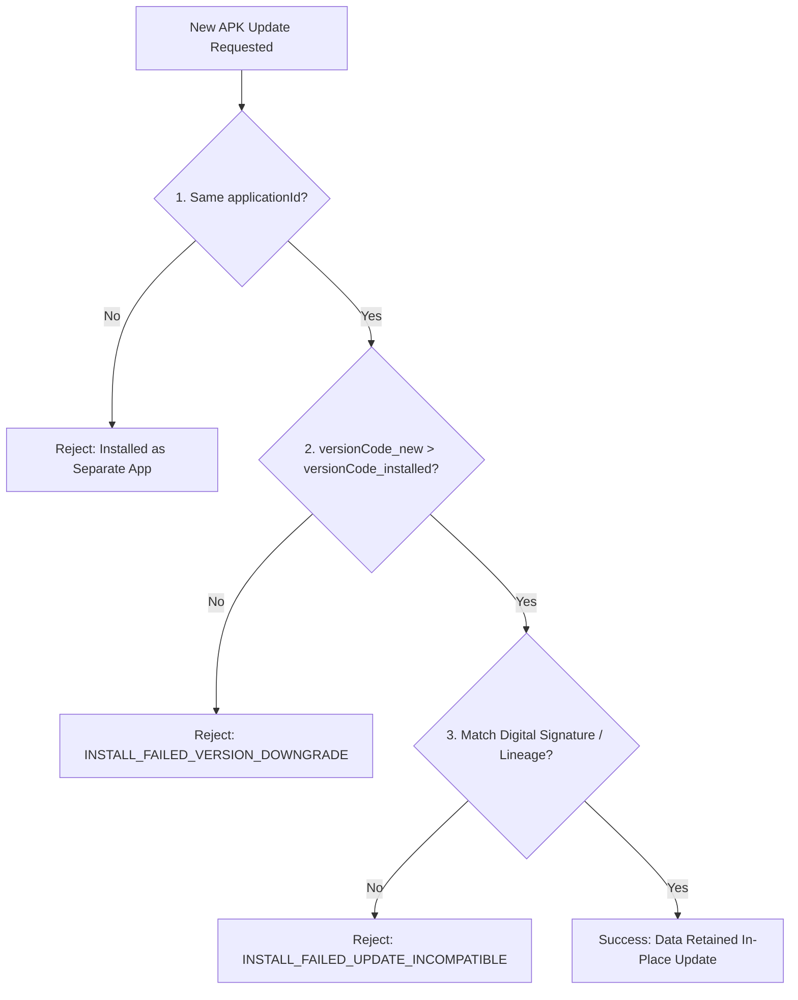

## 앱 업데이트는 applicationId, versionCode, 서명 호환성으로 결정된다

### 내부 메커니즘 (Internal Mechanism)
Android OS의 `PackageManager` 서비스 및 Google Play Store가 기존 설치된 앱의 덮어쓰기 업데이트(Over-the-Air Update)를 허용하는 세 가지 필수 불변 계약:
1. **Identical `applicationId`**: 기존 앱의 고유 패키지 식별자 네임스페이스와 완전 일치해야 한다.
2. **Strictly Increasing `versionCode`**: 기존 설치된 앱의 `versionCode`보다 엄격히 큰 정수(`versionCode_new > versionCode_old`)여야 한다. 동일하거나 낮은 버전 코드는 설치 거부된다.
3. **Cryptographic Signature Compatibility**: 동일한 앱 서명 키로 서명되었거나, APK Signature Scheme v3에 등록된 정식 Key Lineage 검증을 통과해야 한다.



### 코드 예시 (build.gradle.kts Version Strategy)
```kotlin
// app/build.gradle.kts
android {
    defaultConfig {
        applicationId = "com.example.app"
        
        // Dynamic Version Code Generation Strategy
        val buildNumber = System.getenv("BUILD_NUMBER")?.toInt() ?: 1
        versionCode = 10000 + buildNumber
        versionName = "1.0.$buildNumber"
    }
}
```

### 관측 가능 증거 (Observable Evidence)
서명 키가 다른 이전 APK 위로 새 APK 업데이트 설치 시도 시 ADB의 에러 로그를 관측할 수 있다:

```bash
adb install -r build/outputs/apk/release/app-release-mismatched.apk

# Failure Output Example:
# Failure [INSTALL_FAILED_UPDATE_INCOMPATIBLE: Package com.example.app signatures do not match previously installed version; ignoring!]
```

관련 노트: [Android 기본 설정은 식별자와 버전 계약을 만든다](../../build/gradle/gradle-build-contracts/android-default-config-defines-identity-and-version-contracts.md), [Play App Signing은 업로드 키와 앱 서명 키를 분리한다](play-app-signing-separates-upload-key-and-app-signing-key.md)
