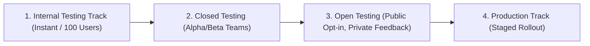

## Google Play 테스트 트랙은 배포 대상과 피드백 범위를 나눈다

### 내부 메커니즘 (Internal Mechanism)
Google Play Console은 상용 프로덕션 배포에 앞서 전 세계 사용자에게 치명적인 런타임 장애가 전파되는 리스크를 단계별로 격리 관리하기 위해 4가지 계층의 **배포 트랙(Release Tracks)** 구조를 제공한다:

1. **Internal Testing Track (내부 테스트 트랙)**: 최대 100명의 지정된 사내 검증자 및 핵심 팀원 대상 배포 경로다. Google Play의 표준 앱 검수(App Review) 절차를 전면 우회하여 빌드 업로드 후 수 분 이내에 사내 기기로 즉시 전파된다.
2. **Closed Testing (비공개 테스트 트랙 - Alpha/Beta)**: 지정된 테스터 집단(Google Group, 이메일 등록자)을 대상으로 신규 기능의 기술적 안정성 및 버그 제보를 수집하는 제한적 트랙이다. 스토어 검수를 통과해야 배포된다.
3. **Open Testing (공개 테스트 트랙)**: Google Play Store에 노출되어 일반 사용자 누구나 자유롭게 테스트에 참여할 수 있다. 단, 작성된 사용자 평가 및 피드백은 공개 스토어 평점에 반영되지 않고 개발자 전용 대시보드로 격리 수집되어 스토어 평점 방어 효과를 갖는다.
4. **Production Track (프로덕션 트랙)**: 전체 일반 사용자를 대상으로 상용 아티팩트를 공식 퍼블리싱하는 최상위 배포 경로다.



### 코드 예시 (Gradle Play Publisher DSL)
```kotlin
// app/build.gradle.kts (com.github.triplet.play plugin)
play {
    track.set("internal") // "internal", "alpha", "beta", "production"
    userFraction.set(1.0)
    releaseStatus.set(com.github.triplet.gradle.play.enum.ReleaseStatus.COMPLETED)
}
```

### 관측 가능 증거 (Observable Evidence)
CI 파이프라인에서 Gradle Play Publisher를 통해 아티팩트가 지정된 트랙으로 배포되었음을 API 응답으로 확인할 수 있다:

```bash
./gradlew publishBundle --track internal

# Output Example:
# > Task :app:publishBundle
# Uploaded AAB to Play Console Track: internal (Release Version 1.2.0-10021)
# Track promotion status: Success
```

관련 노트: [내부 앱 공유는 릴리스 트랙이 아니라 빠른 아티팩트 공유다](internal-app-sharing-is-fast-artifact-sharing-not-release-track.md), [단계적 출시는 관측 가능한 릴리스 운영 절차다](staged-rollout-is-observable-release-operation.md)
