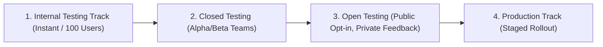

## Google Play 테스트 트랙은 배포 대상과 피드백 범위를 나눈다

### 내부 메커니즘 (Internal Mechanism)
Google Play Console은 프로덕션 출시에 앞서 위험 범위를 단계적으로 격리하기 위해 4가지 레벨의 배포 트랙(Release Tracks)을 운영한다:
1. **Internal Testing (내부 테스트)**: 최대 100명의 지정된 사내 검증자 대상. Play 검수(App Review) 절차를 우회하여 몇 분 내 즉시 업데이트 전파.
2. **Closed Testing (비공개 테스트 - Alpha/Beta)**: 테스터 이메일 리스트 또는 Google Group 테스터 대상. 신규 기능의 안정성 및 피드백 수집.
3. **Open Testing (공개 테스트)**: Play Store에 공개되어 누구나 참여 가능하나 스토어 리뷰 작성 시 일반 사용자에게 평점이 반영되지 않고 개발자 전용 피드백으로 수집됨.
4. **Production (프로덕션)**: 전체 일반 사용자 대상 배포.



### 코드 예시 (Gradle Play Publisher DSL)
```kotlin
// app/build.gradle.kts (com.github.triplet.play plugin)
play {
    track.set("internal") // "internal", "alpha", "beta", "production"
    userFraction.set(1.0)
    releaseStatus.set(com.github.triplet.gradle.play.enum.ReleaseStatus.COMPLETED)
}
```

### 관측 가능 증거 (Observable Evidence)
CI 파이프라인에서 Gradle Play Publisher를 통해 아티팩트가 지정된 트랙으로 배포되었음을 API 응답으로 확인할 수 있다:

```bash
./gradlew publishBundle --track internal

# Output Example:
# > Task :app:publishBundle
# Uploaded AAB to Play Console Track: internal (Release Version 1.2.0-10021)
# Track promotion status: Success
```

관련 노트: [내부 앱 공유는 릴리스 트랙이 아니라 빠른 아티팩트 공유다](internal-app-sharing-is-fast-artifact-sharing-not-release-track.md), [단계적 출시는 관측 가능한 릴리스 운영 절차다](staged-rollout-is-observable-release-operation.md)
