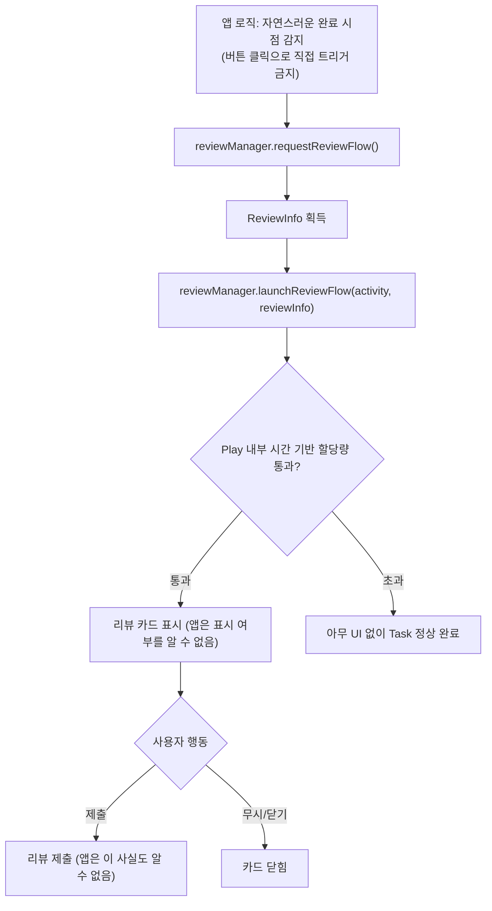

## In-App Review API는 리뷰 제출을 보장하지 않고 요청만 할 수 있다

### 내부 메커니즘 (Internal Mechanism)

Play Core SDK의 **In-App Review API (`ReviewManager`)**는 사용자를 외부 Google Play Store 앱으로 탈출시키지 않고, 현재 앱 화면 위에 경량 팝업 카드를 띄워 별점과 리뷰를 즉시 남길 수 있게 돕는 사용자 경험 개선 API다. 하지만 이 API의 설계 계약상 앱은 단지 리뷰 카드 노출을 **요청(request)**만 할 수 있을 뿐, 실제로 사용자의 눈앞에 다이얼로그 카드가 떴는지, 혹은 사용자가 실제 평가를 작성했는지는 일체 관찰하거나 강제할 수 없다.

공식 규격은 `launchReviewFlow()`를 앱 런타임 중 짧은 시간 동안 여러 번 호출하더라도 매번 다이얼로그 카드가 노출되는 것을 허용하지 않는다. 이는 Google Play 서버가 사용자의 앱 이용 몰입감 방해를 막기 위해 내부적으로 **Time-bound Quota(시간 기반 할당량)**를 강제로 지정하고 관리하기 때문이다. 이 할당량 정책의 구체적 임계값은 외부로 공개되지 않는 내부 구현 세부사항이다. 따라서 개발자는 "API 호출 성공(`Task.isSuccessful`)이 곧 리뷰 카드의 렌더링 노출을 의미한다"고 잘못 가정하고 다음 화면 이동이나 인센티브 지급 로직을 결합해서는 절대 안 된다.

또한 Google Play 가이드라인은 사용자가 버튼("리뷰 작성하기")을 클릭했을 때 이 API를 직접 호출하는 패턴(Call-to-Action)을 명시적으로 금지한다. 사용자가 버튼을 눌렀음에도 할당량 초과로 아무 카드도 렌더링되지 않을 경우 발생하는 유저 혼란을 방지하기 위함이다. 대신 사용자가 스테이지를 클리어하거나 미션을 완수한 자연스러운 유휴 시점에 백그라운드에서 자동 요청하는 방식만을 허용한다.



### 코드 예시 (Kotlin, ReviewManager)

```kotlin
class GameCompletionActivity : AppCompatActivity() {

    private val reviewManager by lazy { ReviewManagerFactory.create(this) }

    private fun maybeRequestReview() {
        // 자연스러운 완료 시점(레벨 클리어 등)에만 호출 — 버튼 클릭 트리거 금지
        val requestFlow = reviewManager.requestReviewFlow()
        requestFlow.addOnCompleteListener { request ->
            if (request.isSuccessful) {
                val reviewInfo: ReviewInfo = request.result
                val flow = reviewManager.launchReviewFlow(this, reviewInfo)
                flow.addOnCompleteListener {
                    // 이 콜백은 "요청 흐름이 끝났다"만 의미한다.
                    // 카드가 실제로 표시됐는지, 사용자가 제출했는지는 여기서 알 수 없다.
                    proceedToNextScreen()
                }
            } else {
                // requestReviewFlow 자체가 실패한 경우 (예: Play Store 미설치)
                proceedToNextScreen()
            }
        }
    }
}
```

### 관측 가능 증거 (Observable Evidence)

```bash
# 클라이언트 로그로는 카드 표시/제출 여부를 확인할 수 없다.
# 실제 리뷰 제출 여부와 평점 추이는 Play Console의 리뷰/평점 대시보드에서만 확인 가능하다.

# API 호출 자체가 실패하는 경우(Play Store 미설치, 오래된 Play Core 버전 등)만 로그로 구분한다
adb logcat | grep -E "ReviewException|ERROR_PLAY_STORE_NOT_FOUND"
```

### 경계

- "리뷰 카드가 항상 즉시 뜬다"고 가정하고 이후 로직을 분기하면 안 된다 — 호출 성공(`Task.isSuccessful`)과 카드 표시/제출은 서로 다른 사건이다. 이 노트가 명시하는 "요청만 가능하다"는 계약을 위반하는 가장 흔한 구현 실수다.
- 사용자를 Play Store 리뷰 페이지로 직접 이동시키는 딥링크(`market://details?id=...`) 방식은 In-App Review API와 다른 경로다 — 이 경로는 앱을 벗어나므로 항상 성공적으로 리뷰 화면에 도달하지만, In-App Review처럼 앱 내에 머무르지 않는다.

관련 노트: [In-App Update의 flexible과 immediate 흐름은 사용자 흐름 차단 여부가 다르다](in-app-update-flexible-and-immediate-flows-differ-in-blocking.md), [Play 릴리스와 배포 계약](release-distribution-contracts.md)
