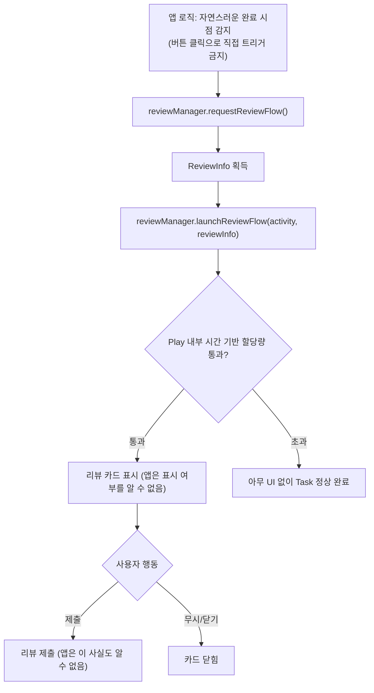

## In-App Review API는 리뷰 제출을 보장하지 않고 요청만 할 수 있다

### 내부 메커니즘 (Internal Mechanism)

Play Core의 **In-App Review API**(`ReviewManager`)는 앱을 벗어나지 않고 Play 리뷰 카드를 앱 위에 띄워 사용자가 별점/리뷰를 남기도록 요청하는 API다. 계약상 앱이 할 수 있는 것은 **요청(request)** 뿐이며 실제로 카드가 표시되는지, 사용자가 리뷰를 제출하는지는 앱이 관찰하거나 강제할 수 없다.

공식 문서는 `launchReviewFlow()` 를 짧은 기간(예: 한 달 미만) 안에 여러 번 호출해도 매번 다이얼로그가 뜨지 않을 수 있다고 명시한다 — Google Play가 사용자 경험 보호를 위해 **시간 기반 할당량(time-bound quota)** 을 내부적으로 강제하기 때문이다. 이 할당량의 구체적인 수치는 구현 세부사항으로 공개되지 않으며 공지 없이 바뀔 수 있다. 따라서 앱은 "리뷰 카드가 항상 뜬다"고 가정한 로직(예: 카드가 뜬 것을 성공 신호로 다음 화면을 분기하는 로직)을 만들면 안 된다 — `launchReviewFlow()` 의 `Task` 가 성공으로 완료돼도 그것은 "요청 처리가 끝났다"는 뜻이지 "카드가 사용자에게 보였다"거나 "리뷰가 제출됐다"는 뜻이 아니다.

호출 방식에도 제약이 있다. Google Play 가이드라인은 버튼을 눌러 API를 직접 트리거하는 방식(call-to-action)을 금지한다 — 사용자가 할당량을 초과한 상태에서 버튼을 눌렀는데 아무 일도 일어나지 않으면 사용자 경험이 나빠지기 때문이다. 대신 앱이 자체 판단으로 "사용자가 앱을 충분히 경험한 자연스러운 시점"(레벨 클리어, 작업 완료 등)에 자동으로 요청하고, 카드 자체는 수정하거나 오버레이를 얹을 수 없다.



### 코드 예시 (Kotlin, ReviewManager)

```kotlin
class GameCompletionActivity : AppCompatActivity() {

    private val reviewManager by lazy { ReviewManagerFactory.create(this) }

    private fun maybeRequestReview() {
        // 자연스러운 완료 시점(레벨 클리어 등)에만 호출 — 버튼 클릭 트리거 금지
        val requestFlow = reviewManager.requestReviewFlow()
        requestFlow.addOnCompleteListener { request ->
            if (request.isSuccessful) {
                val reviewInfo: ReviewInfo = request.result
                val flow = reviewManager.launchReviewFlow(this, reviewInfo)
                flow.addOnCompleteListener {
                    // 이 콜백은 "요청 흐름이 끝났다"만 의미한다.
                    // 카드가 실제로 표시됐는지, 사용자가 제출했는지는 여기서 알 수 없다.
                    proceedToNextScreen()
                }
            } else {
                // requestReviewFlow 자체가 실패한 경우 (예: Play Store 미설치)
                proceedToNextScreen()
            }
        }
    }
}
```

### 관측 가능 증거 (Observable Evidence)

```bash
# 클라이언트 로그로는 카드 표시/제출 여부를 확인할 수 없다.
# 실제 리뷰 제출 여부와 평점 추이는 Play Console의 리뷰/평점 대시보드에서만 확인 가능하다.

# API 호출 자체가 실패하는 경우(Play Store 미설치, 오래된 Play Core 버전 등)만 로그로 구분한다
adb logcat | grep -E "ReviewException|ERROR_PLAY_STORE_NOT_FOUND"
```

### 경계

- "리뷰 카드가 항상 즉시 뜬다"고 가정하고 이후 로직을 분기하면 안 된다 — 호출 성공(`Task.isSuccessful`)과 카드 표시/제출은 서로 다른 사건이다. 이 노트가 명시하는 "요청만 가능하다"는 계약을 위반하는 가장 흔한 구현 실수다.
- 사용자를 Play Store 리뷰 페이지로 직접 이동시키는 딥링크(`market://details?id=...`) 방식은 In-App Review API와 다른 경로다 — 이 경로는 앱을 벗어나므로 항상 성공적으로 리뷰 화면에 도달하지만, In-App Review처럼 앱 내에 머무르지 않는다.

관련 노트: [In-App Update의 flexible과 immediate 흐름은 사용자 흐름 차단 여부가 다르다](in-app-update-flexible-and-immediate-flows-differ-in-blocking.md), [Play 릴리스와 배포 계약](release-distribution-contracts.md)
