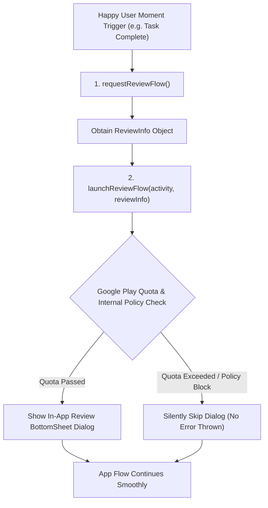

## In-app review API는 리뷰를 요청할 뿐 보장하지 않는다

상위 문서: [릴리스 배포 계약](release-distribution-contracts.md)

### 개념 및 필요성 (What & Why)
**In-App Review API(인앱 리뷰 API - Android Play In-App Review Library)** 는 사용자가 앱을 이탈하여 Play 스토어로 이동하지 않고도, 앱 내부 팝업 바텀시트에서 즉시 평점 별점과 리뷰 텍스트를 남길 수 있게 만드는 모듈이다.
개발자가 반드시 인지해야 하는 핵심 규약은 **In-App Review API 호출이 사용자에게 리뷰 다이얼로그 팝업 노출을 절대 보장하지 않는다(No Guarantee)** 는 점이다.
Google Play는 과도한 리뷰 팝업 남발로 인한 사용자 경험 저해를 막기 위해 엄격한 쿼터(Quota)와 내부 쿨다운 알고리즘을 적용하기 때문이다.

### 내부 메커니즘 (Internal Mechanism)
1. **Quota & Rate Limiting**: 사용자가 최근 이미 인앱 리뷰 다이얼로그를 보았거나 쿼터 한도에 도달한 경우, `launchReviewFlow()`를 호출해도 다이얼로그가 표시되지 않고 즉시 성공 콜백이 반환됨.
2. **의사결정 조건 분기 금지**: API 호출 후 다이얼로그가 실제로 떴는지 안 떴는지, 사용자가 리뷰를 썼는지 취소했는지를 앱 소스 코드에서 전혀 구별하거나 알 수 없음 (보안 및 사기 평가 방지 목적).
3. **권장 UX 타이밍**: 사용자가 앱에서 긍정적인 가치(예: 레벨 완료, 결제 성공, 미션 성공)를 경험한 직후 자연스럽게 호출해야 함.



### 코드 예시 (ReviewManager Integration)
```kotlin
// InAppReviewHelper.kt
val manager = ReviewManagerFactory.create(context)
val request = manager.requestReviewFlow()

request.addOnCompleteListener { task ->
    if (task.isSuccessful) {
        val reviewInfo = task.result
        // 리뷰 플로우 시작 (다이얼로그 노출 여부는 Google Play가 결정)
        val flow = manager.launchReviewFlow(activity, reviewInfo)
        flow.addOnCompleteListener { _ ->
            // 리뷰 작성 완료 여부와 관계없이 다음 앱 로직으로 진행
            navigateToNextScreen()
        }
    } else {
        // 실패 시에도 앱 흐름이 멈춰선 안 됨
        navigateToNextScreen()
    }
}
```

### 관측 가능 증거 (Observable Evidence)
인앱 리뷰 테스팅은 `FakeReviewManager` 클래스를 사용하여 런타임 동작을 유닛 테스트로 관측할 수 있다:
```bash
./gradlew testDebugUnitTest --tests "*.InAppReviewTest"
```

관련 노트: [In-app update의 flexible과 immediate 흐름은 블로킹에서 차이가 난다](in-app-update-flexible-and-immediate-flows-differ-in-blocking.md), [릴리스 배포 계약](release-distribution-contracts.md)
