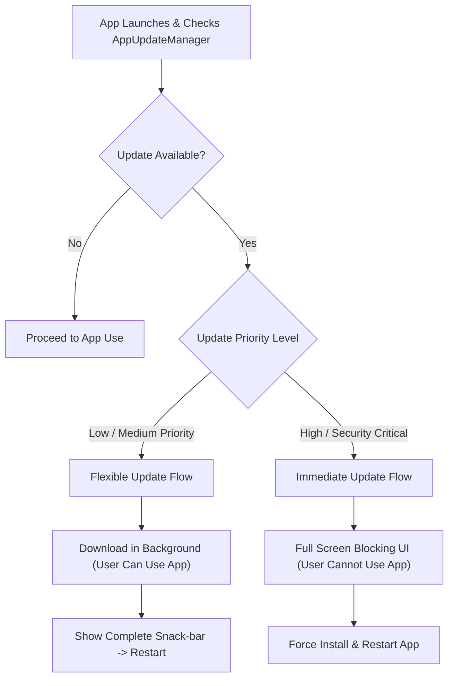

## In-app update의 flexible과 immediate 흐름은 블로킹에서 차이가 난다

상위 문서: [릴리스 배포 계약](release-distribution-contracts.md)

### 개념 및 필요성 (What & Why)
**In-App Update API(인앱 업데이트 API - Android Play Core / App Update Library)** 는 사용자가 Play 스토어 앱으로 직접 이동하지 않고도 앱 내부에서 즉시 최신 버전 업그레이드를 감지하고 진행할 수 있게 만드는 런타임 갱신 UX 인터페이스이다.
In-App Update는 UX 사용성 관점에서 **Flexible(유연한 업데이트)** 흐름과 **Immediate(즉시/전면 블로킹 업데이트)** 흐름의 2가지 방식을 제공하며, 업데이트의 긴급성에 따라 명확히 구분 적용된다.

### 내부 메커니즘 (Internal Mechanism)
1. **Flexible Update (비블로킹 / 선택적 업데이트)**:
   - 권장 기능 업데이트나 일반 버그 수정 시 사용.
   - 백그라운드에서 업데이트 APK를 다운로드받는 동안 사용자는 앱을 정상 사용할 수 있음. 다운로드 완료 시 "재시작 적용" 스낵바 제공.
2. **Immediate Update (블로킹 / 강제 업데이트)**:
   - 보안 치명적 취약점 패치나 서버 API 파괴 변경(Breaking Change) 시 사용.
   - 전체 화면을 전면 차단(Full Screen Blocking UI)하여 업데이트 완료 및 앱 재시작 전까지 앱 사용을 완벽히 금지함.



### 코드 예시 (AppUpdateManager Integration)
```kotlin
// InAppUpdateManager.kt
val appUpdateManager = AppUpdateManagerFactory.create(context)
val appUpdateInfoTask = appUpdateManager.appUpdateInfo

appUpdateInfoTask.addOnSuccessListener { appUpdateInfo ->
    if (appUpdateInfo.updateAvailability() == UpdateAvailability.UPDATE_AVAILABLE) {
        if (appUpdateInfo.isUpdateTypeAllowed(AppUpdateType.IMMEDIATE)) {
            // 강제 즉시 업데이트 실행
            appUpdateManager.startUpdateFlowForResult(
                appUpdateInfo,
                AppUpdateType.IMMEDIATE,
                activity,
                MY_REQUEST_CODE
            )
        }
    }
}
```

### 관측 가능 증거 (Observable Evidence)
인앱 업데이트 API 통합 및 테스트는 FakeAppUpdateManager 도구를 통해 런타임 동작을 관측할 수 있다:
```bash
./gradlew connectedDebugAndroidTest -Pandroid.testInstrumentationRunnerArguments.class=com.example.InAppUpdateTest
```

관련 노트: [In-app review API는 리뷰를 요청할 뿐 보장하지 않는다](in-app-review-api-can-only-request-not-guarantee-a-review.md), [릴리스 배포 계약](release-distribution-contracts.md)
