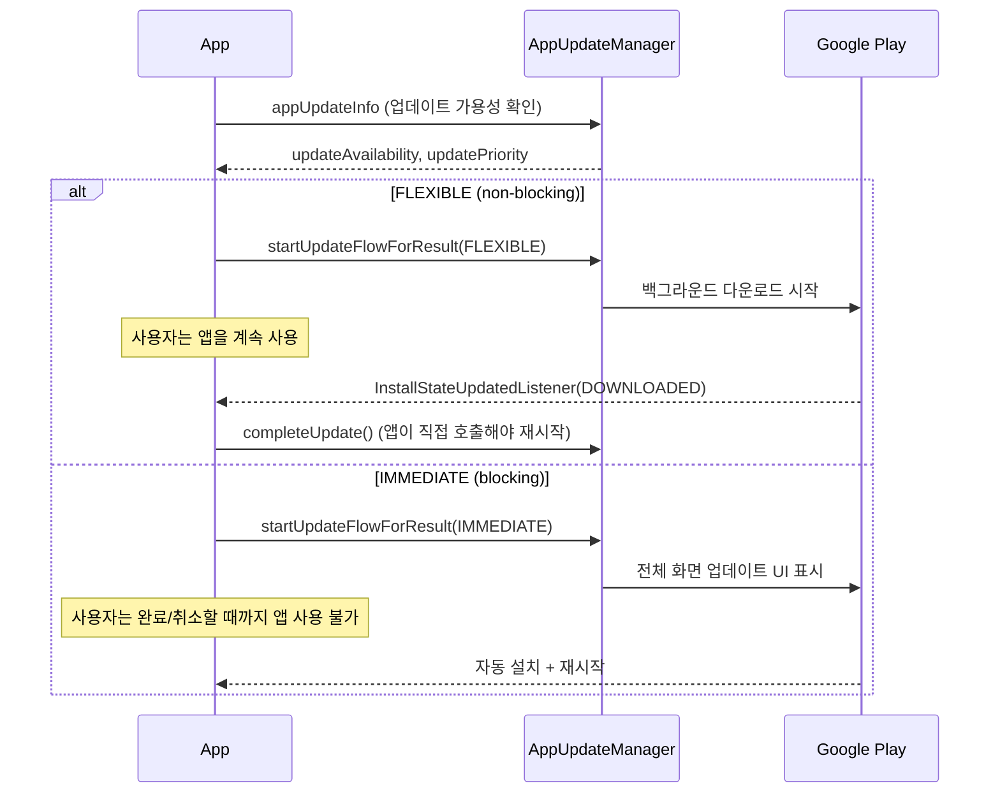

## In-App Update의 flexible과 immediate 흐름은 사용자 흐름 차단 여부가 다르다

### 내부 메커니즘 (Internal Mechanism)

Play Core의 **In-App Update API**(`AppUpdateManager`)는 앱이 스토어로 사용자를 내보내지 않고 앱 안에서 업데이트를 트리거할 수 있게 한다. `AppUpdateType` 은 두 가지이며, 핵심 차이는 **업데이트 진행 중 사용자가 앱을 계속 쓸 수 있는지**다.

- **`AppUpdateType.FLEXIBLE`**: 백그라운드에서 새 버전을 다운로드하는 동안 사용자는 현재 화면을 계속 사용할 수 있다(non-blocking). 다운로드 완료(`InstallStatus.DOWNLOADED`) 후에는 앱이 명시적으로 `completeUpdate()` 를 호출해 재시작을 유도해야 실제 설치가 끝난다 — 이 재시작 트리거는 자동이 아니라 앱 책임이다.
- **`AppUpdateType.IMMEDIATE`**: 전체 화면 UI로 업데이트 진행 상황을 보여주며 사용자가 업데이트를 완료(또는 취소)할 때까지 앱 사용이 중단된다(blocking). 설치와 재시작을 Google Play가 자동으로 처리한다.

두 흐름 모두 시작 전에 `AppUpdateManager.appUpdateInfo` 로 업데이트 가용성과 `updatePriority`, `clientVersionStalenessDays`(현재 버전이 며칠째 뒤처졌는지)를 먼저 확인해야 한다. 이 정보로 "치명적 보안 패치라 즉시 강제해야 한다"와 "부가 기능이라 방해하지 않아야 한다"를 갈라 `IMMEDIATE`/`FLEXIBLE` 중 하나를 선택하는 것이 API 설계 의도다.



### 코드 예시 (Kotlin, Activity Result API 기반)

```kotlin
class MainActivity : AppCompatActivity() {

    private val appUpdateManager by lazy { AppUpdateManagerFactory.create(this) }
    private val updateResultLauncher = registerForActivityResult(
        ActivityResultContracts.StartIntentSenderForResult()
    ) { result ->
        if (result.resultCode != RESULT_OK) {
            // 사용자가 IMMEDIATE 업데이트를 취소했거나 실패
        }
    }

    private val installStateListener = InstallStateUpdatedListener { state ->
        if (state.installStatus() == InstallStatus.DOWNLOADED) {
            // FLEXIBLE: 다운로드는 끝났지만 앱이 직접 재시작을 유도해야 한다
            showRestartSnackbar()
        }
    }

    private fun checkForUpdate() {
        appUpdateManager.registerListener(installStateListener)

        appUpdateManager.appUpdateInfo.addOnSuccessListener { info ->
            val updateType = if (info.updatePriority() >= 4) {
                AppUpdateType.IMMEDIATE
            } else {
                AppUpdateType.FLEXIBLE
            }

            if (info.updateAvailability() == UpdateAvailability.UPDATE_AVAILABLE &&
                info.isUpdateTypeAllowed(updateType)
            ) {
                appUpdateManager.startUpdateFlowForResult(
                    info,
                    updateResultLauncher,
                    AppUpdateOptions.newBuilder(updateType).build(),
                )
            }
        }
    }

    private fun showRestartSnackbar() {
        Snackbar.make(findViewById(android.R.id.content), "업데이트 준비 완료", Snackbar.LENGTH_INDEFINITE)
            .setAction("재시작") { appUpdateManager.completeUpdate() }
            .show()
    }

    override fun onResume() {
        super.onResume()
        // IMMEDIATE 흐름이 중단된 채 앱이 재개된 경우를 다시 확인해야 한다
        appUpdateManager.appUpdateInfo.addOnSuccessListener { info ->
            if (info.updateAvailability() == UpdateAvailability.DEVELOPER_TRIGGERED_UPDATE_IN_PROGRESS) {
                appUpdateManager.startUpdateFlowForResult(
                    info, updateResultLauncher, AppUpdateOptions.newBuilder(AppUpdateType.IMMEDIATE).build(),
                )
            }
        }
    }
}
```

### 관측 가능 증거 (Observable Evidence)

```bash
# InstallStateUpdatedListener의 상태 전이를 로그로 관찰
adb logcat | grep -E "InstallStatus|PENDING|DOWNLOADING|DOWNLOADED|INSTALLED|FAILED"

# FLEXIBLE 흐름에서 completeUpdate()를 호출하지 않으면
# DOWNLOADED 상태에 머문 채 사용자가 앱을 재시작할 때까지 설치가 끝나지 않는다 — 이것이 흔한 구현 누락이다
```

### 경계

- 이 API는 Play Store를 통해 배포된 앱에서만 동작한다 — 사이드로드 설치나 다른 스토어 배포 경로에서는 `updateAvailability()` 가 항상 업데이트 없음을 반환한다.
- 업데이트 승인/서명/트랙 배정 등 Play Console 측 릴리스 운영은 이 노트가 아니라 [Play 릴리스와 배포 계약](release-distribution-contracts.md) 과 [단계적 출시는 관측 가능한 릴리스 운영 절차다](staged-rollout-is-observable-release-operation.md) 가 다룬다. 이 노트는 이미 배포된 업데이트를 클라이언트가 어떻게 받아오는지만 다룬다.

관련 노트: [In-App Review API는 리뷰 제출을 보장하지 않고 요청만 할 수 있다](in-app-review-api-can-only-request-not-guarantee-a-review.md), [Play 릴리스와 배포 계약](release-distribution-contracts.md)
