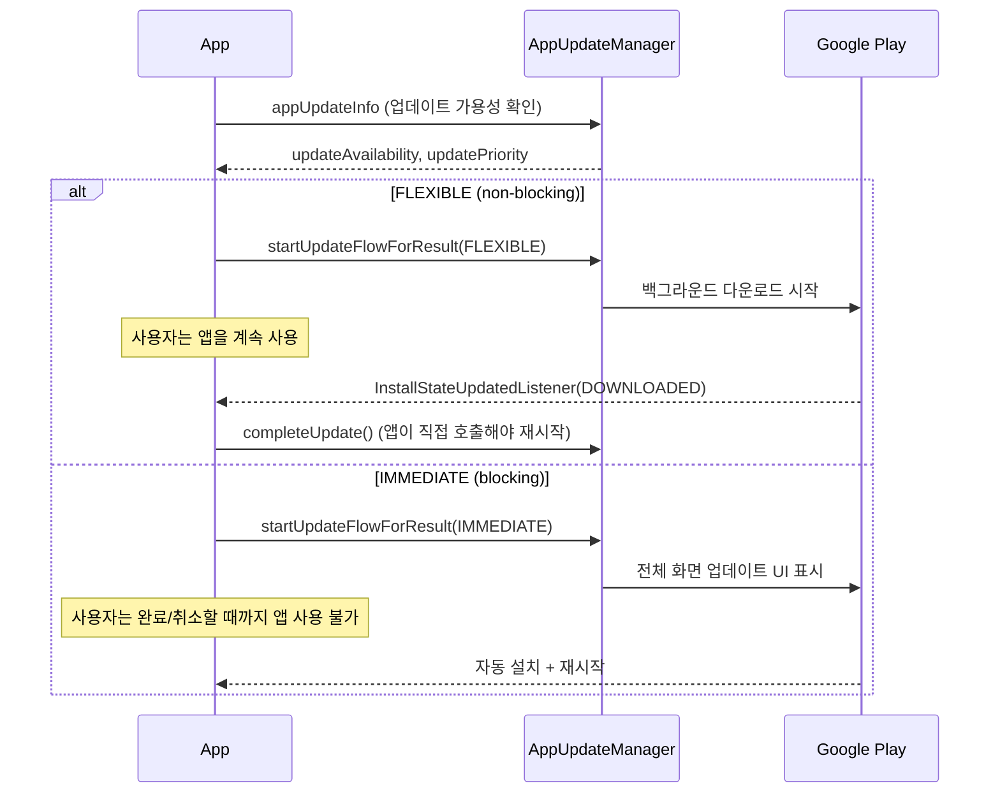

## In-App Update의 flexible과 immediate 흐름은 사용자 흐름 차단 여부가 다르다

### 내부 메커니즘 (Internal Mechanism)

Play Core SDK의 **In-App Update API (`AppUpdateManager`)**는 사용자가 직접 스토어 앱으로 이동하여 업데이트 버튼을 누르는 불편 없이, 앱 자체 화면 내에서 구글 플레이 릴리스 업데이트 흐름을 즉시 트리거할 수 있게 지원한다. 개발자는 업데이트 사안의 긴급도에 따라 두 가지 **AppUpdateType** 중 하나를 선택한다. 핵심 인과관계 차이는 **업데이트 수신 진행 중에 사용자가 앱의 본래 기능을 계속 이용할 수 있는지(사용자 흐름 차단 여부)**에 있다.

- **`AppUpdateType.FLEXIBLE` (비차단형 자율 업데이트)**: Google Play 서비스가 백그라운드 네트워크 스트림으로 신규 바이너리를 다운로드하는 동안 사용자는 앱의 기존 UI 및 기능 메뉴를 차단 없이 계속 이용할 수 있다(non-blocking). 다운로드가 끝나면 `InstallStatus.DOWNLOADED` 이벤트가 발행되며, 이때 앱이 직접 `completeUpdate()` 메서드를 명시적으로 트리거해야만 앱이 재시작되면서 최종 인스톨이 완료된다. 즉, 다운로드 후 실제 적용 재시작 시점은 앱의 관리 책임이다.
- **`AppUpdateType.IMMEDIATE` (차단형 강제 업데이트)**: 치명적인 보안 패치나 서버 API 호환성 단절 등 구버전 실행이 불가능한 경우 전체 화면 업데이트 프로그레스 UI를 띄워 사용자의 앱 이행을 완전히 차단한다(blocking). 다운로드 완료 후 앱 재시작 및 설치 적용까지 Google Play 런타임이 전권을 가지고 자동 수행한다.

두 흐름 모두 호출 전 `AppUpdateManager.appUpdateInfo`를 통해 스토어 상의 신규 업데이트 가용성(`UpdateAvailability.UPDATE_AVAILABLE`), 구글 콘솔에 지정된 업데이트 우선순위(`updatePriority`), 그리고 버전 지연 일수(`clientVersionStalenessDays`)를 사전에 조회하여 정책 판단을 내리는 것이 올바른 디자인 패턴이다.



### 코드 예시 (Kotlin, Activity Result API 기반)

```kotlin
class MainActivity : AppCompatActivity() {

    private val appUpdateManager by lazy { AppUpdateManagerFactory.create(this) }
    private val updateResultLauncher = registerForActivityResult(
        ActivityResultContracts.StartIntentSenderForResult()
    ) { result ->
        if (result.resultCode != RESULT_OK) {
            // 사용자가 IMMEDIATE 업데이트를 취소했거나 실패
        }
    }

    private val installStateListener = InstallStateUpdatedListener { state ->
        if (state.installStatus() == InstallStatus.DOWNLOADED) {
            // FLEXIBLE: 다운로드는 끝났지만 앱이 직접 재시작을 유도해야 한다
            showRestartSnackbar()
        }
    }

    private fun checkForUpdate() {
        appUpdateManager.registerListener(installStateListener)

        appUpdateManager.appUpdateInfo.addOnSuccessListener { info ->
            val updateType = if (info.updatePriority() >= 4) {
                AppUpdateType.IMMEDIATE
            } else {
                AppUpdateType.FLEXIBLE
            }

            if (info.updateAvailability() == UpdateAvailability.UPDATE_AVAILABLE &&
                info.isUpdateTypeAllowed(updateType)
            ) {
                appUpdateManager.startUpdateFlowForResult(
                    info,
                    updateResultLauncher,
                    AppUpdateOptions.newBuilder(updateType).build(),
                )
            }
        }
    }

    private fun showRestartSnackbar() {
        Snackbar.make(findViewById(android.R.id.content), "업데이트 준비 완료", Snackbar.LENGTH_INDEFINITE)
            .setAction("재시작") { appUpdateManager.completeUpdate() }
            .show()
    }

    override fun onResume() {
        super.onResume()
        // IMMEDIATE 흐름이 중단된 채 앱이 재개된 경우를 다시 확인해야 한다
        appUpdateManager.appUpdateInfo.addOnSuccessListener { info ->
            if (info.updateAvailability() == UpdateAvailability.DEVELOPER_TRIGGERED_UPDATE_IN_PROGRESS) {
                appUpdateManager.startUpdateFlowForResult(
                    info, updateResultLauncher, AppUpdateOptions.newBuilder(AppUpdateType.IMMEDIATE).build(),
                )
            }
        }
    }
}
```

### 관측 가능 증거 (Observable Evidence)

```bash
# InstallStateUpdatedListener의 상태 전이를 로그로 관찰
adb logcat | grep -E "InstallStatus|PENDING|DOWNLOADING|DOWNLOADED|INSTALLED|FAILED"

# FLEXIBLE 흐름에서 completeUpdate()를 호출하지 않으면
# DOWNLOADED 상태에 머문 채 사용자가 앱을 재시작할 때까지 설치가 끝나지 않는다 — 이것이 흔한 구현 누락이다
```

### 경계

- 이 API는 Play Store를 통해 배포된 앱에서만 동작한다 — 사이드로드 설치나 다른 스토어 배포 경로에서는 `updateAvailability()` 가 항상 업데이트 없음을 반환한다.
- 업데이트 승인/서명/트랙 배정 등 Play Console 측 릴리스 운영은 이 노트가 아니라 [Play 릴리스와 배포 계약](release-distribution-contracts.md) 과 [단계적 출시는 관측 가능한 릴리스 운영 절차다](staged-rollout-is-observable-release-operation.md) 가 다룬다. 이 노트는 이미 배포된 업데이트를 클라이언트가 어떻게 받아오는지만 다룬다.

관련 노트: [In-App Review API는 리뷰 제출을 보장하지 않고 요청만 할 수 있다](in-app-review-api-can-only-request-not-guarantee-a-review.md), [Play 릴리스와 배포 계약](release-distribution-contracts.md)
