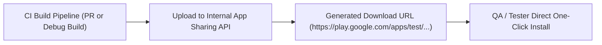

## 내부 앱 공유는 릴리스 트랙이 아니라 빠른 아티팩트 공유다

### 내부 메커니즘 (Internal Mechanism)
**Internal App Sharing (내부 앱 공유)**는 정식 Play Console의 배포 트랙(Internal/Closed/Production Track)과 완전히 격리된 별개의 아티팩트 샌드박스 고속 공유 메커니즘이다.

- **`versionCode` 검증 규칙 무시**: 기존 상용 프로덕션 환경에 이미 배포되어 있는 `versionCode`보다 낮거나 동일한 버전 코드를 가진 디버그/임시 아티팩트도 스토어 거절 없이 자유롭게 업로드하고 테스트 디바이스에 설치할 수 있다.
- **서명 인증서 자유도 및 Play 임시 재서명**: 정식 Upload Key가 아닌 디버그용 임시 `.jks` 키로 서명된 AAB/APK 산출물도 업로드가 허용되며, Google Play 인프라가 다운로드 제공 시 내부 테스트 전용 키로 임시 재서명하여 URL을 구성한다.
- **스토어 앱 검수(App Review) 우회**: Google Play의 까다로운 앱 검수 절차를 일절 거치지 않으므로, CI 파이프라인에서 업로드 API 호출 직후 수 초 이내에 전용 원클릭 다운로드 URL(`https://play.google.com/apps/test/...`)이 생성되어 QA 엔지니어 및 기획자에게 즉시 전파된다.



### 코드 예시 (cURL & Play Developer API Upload)
```bash
# Google Play Developer API - Internal App Sharing Upload Script
curl -X POST   -H "Authorization: Bearer $PLAY_API_TOKEN"   -F "apk=@app-debug.apk"   "https://androidpublisher.googleapis.com/androidpublisher/v3/applications/internalappsharing/com.example.app/artifacts/apk"
```

### 관측 가능 증거 (Observable Evidence)
API 호출 완료 후 Play Store에서 리턴하는 고유 렌더링 다운로드 URL 구조 응답을 관측할 수 있다:

```json
{
  "downloadUrl": "https://play.google.com/apps/test/com.example.app/104",
  "certificateFingerprint": "E4:F5:67:89:..."
}
```

관련 노트: [Google Play 테스트 트랙은 배포 대상과 피드백 범위를 나눈다](google-play-testing-tracks-split-audience-and-feedback-scope.md), [Play 릴리스와 배포 계약](release-distribution-contracts.md)
