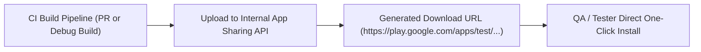

## 내부 앱 공유는 릴리스 트랙이 아니라 빠른 아티팩트 공유다

### 내부 메커니즘 (Internal Mechanism)
**Internal App Sharing (내부 앱 공유)**는 정식 Play Console 릴리스 트랙과 본질적으로 다른 아티팩트 샌드박스 공유 메커니즘이다.
- **versionCode 제한 우회**: 기존 프로덕션 버전보다 낮은 `versionCode`를 가진 빌드도 업로드 및 설치가 가능하다.
- **서명 자유도**: 내부 앱 공유 전용 인증서나 디버그 키로 서명된 AAB/APK도 업로드가 허용되며, Play가 임시 내부 키로 재서명하여 다운로드 링크를 제공한다.
- **검수 절차 무시**: Play Store의 정식 앱 검수(App Review Phase)를 거치지 않고 업로드 직후 수초 내 고유 URL이 생성되어 QA팀 및 기획자에게 전파된다.



### 코드 예시 (cURL & Play Developer API Upload)
```bash
# Google Play Developer API - Internal App Sharing Upload Script
curl -X POST   -H "Authorization: Bearer $PLAY_API_TOKEN"   -F "apk=@app-debug.apk"   "https://androidpublisher.googleapis.com/androidpublisher/v3/applications/internalappsharing/com.example.app/artifacts/apk"
```

### 관측 가능 증거 (Observable Evidence)
API 호출 완료 후 Play Store에서 리턴하는 고유 렌더링 다운로드 URL 구조 응답을 관측할 수 있다:

```json
{
  "downloadUrl": "https://play.google.com/apps/test/com.example.app/104",
  "certificateFingerprint": "E4:F5:67:89:..."
}
```

관련 노트: [Google Play 테스트 트랙은 배포 대상과 피드백 범위를 나눈다](google-play-testing-tracks-split-audience-and-feedback-scope.md), [Play 릴리스와 배포 계약](release-distribution-contracts.md)
