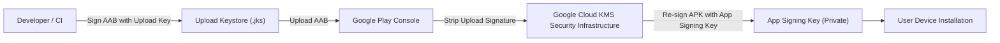

## Play App Signing은 업로드 키와 앱 서명 키를 분리한다

### 내부 메커니즘 (Internal Mechanism)
Play App Signing은 개발자의 키 유출 위험을 방지하기 위해 서명 키의 소유 및 검증 구조를 두 계층으로 분리한다:
1. **Upload Key (업로드 키)**: 개발자가 로컬/CI 환경에서 소유하는 서명 키. Play Store에 AAB 아티팩트를 업로드할 때 개발자 정체성을 증명하는 용도로만 사용된다. (분실 시 Google Play Console에서 키 재설정 요청 가능)
2. **App Signing Key (앱 서명 키)**: Google Cloud Key Management Service (KMS) 보안 인프라 내부에서 관리되는 실제 서명 키. Play가 AAB로부터 최적화된 APK를 생성한 후 최종 사용자 디바이스 배포 직전에 서명한다.



### 코드 예시 (PEPK Tool - Play Encrypted Private Key Export)
```bash
# 기존 KeyStore로부터 Play App Signing용 암호화된 서명 키 추출 명령
java -jar pepk.jar   --keystore=release-keystore.jks   --alias=my-key-alias   --output=encrypted_private_key.pem   --encryptionkey=eb10fe8f7c7c9df715022017b0377e64f46b555430b50715e4a071a550e0f407061c5813e07d7405596b713c186ef7fd102a
```

### 관측 가능 증거 (Observable Evidence)
Play Store에서 다운로드된 APK의 최종 서명 핑거프린트가 로컬 Upload Key 핑거프린트와 상이함을 `apksigner` 도구로 확인할 수 있다:

```bash
apksigner verify --print-certs downloaded-from-play.apk

# Output Example:
# Certificate SHA-256 digest (App Signing Key by Google): 99:AA:BB:CC:... (Local upload key fingerprint와 다름)
```

관련 노트: [Signing config는 로컬 서명과 Play 배포 정체성을 연결한다](../../build/gradle/gradle-build-contracts/signing-config-connects-local-signing-and-play-release-identity.md), [Play 릴리스와 배포 계약](release-distribution-contracts.md)
