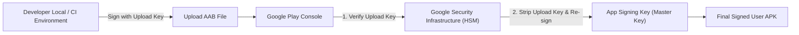

## Play app signing은 업로드 키와 앱 서명 키를 분리한다

상위 문서: [릴리스 배포 계약](release-distribution-contracts.md)

### 개념 및 필요성 (What & Why)
**Play App Signing(플레이 앱 서명)** 은 앱 서명 자격증명의 보안 관리를 개발자 개인이 아닌 Google의 보안 인프라 서비스로 이관하는 필수 배포 보안 계약이다.
과거 방식에서는 개발자가 단 하나의 키스토어(Keystore)로 앱 서명과 업로드를 모두 처리했다. 만약 개발자 하드디스크 고장이나 퇴사로 해당 키스토어를 잃어버리면 기존 앱을 평생 업데이트할 수 없게 되어 앱을 폐기해야 하는 치명적 위험이 존재했다.
Play App Signing은 **업로드 키(Upload Key)** 와 **앱 서명 키(App Signing Key)** 를 이원화(Separation)하여 이 문제를 근본적으로 해결한다.

### 내부 메커니즘 (Internal Mechanism)
1. **Upload Key (개발자 보유)**: 개발자/CI 환경에서 AAB 빌드 시 서명하는 용도로만 사용됨. 만약 분실하더라도 Google Play 콘솔 지원을 통해 키 재발급(Reset) 가능.
2. **App Signing Key (Google 보관)**: Google Play의 보안 HSM(Hardware Security Module) 인프라 내에 영구히 격리 저장됨.
3. **재서명 프로세스**:
   - 개발자가 Upload Key로 서명된 AAB를 Play Console에 제출함.
   - Google Play는 Upload Key 정합성을 검증한 후 Upload Key 서명을 제거함.
   - Google HSM에 저장된 실제 App Signing Key로 사용자 디바이스용 Split APK를 최종 서명하여 배포함.



### 코드 예시 (build.gradle.kts - Upload Key 적용)
```kotlin
// app/build.gradle.kts (업로드 키스토어 설정)
android {
    signingConfigs {
        create("release") {
            storeFile = file("upload-keystore.jks") // 업로드 키스토어
            storePassword = System.getenv("UPLOAD_KEYSTORE_PASSWORD") ?: ""
            keyAlias = System.getenv("UPLOAD_KEY_ALIAS") ?: ""
            keyPassword = System.getenv("UPLOAD_KEY_PASSWORD") ?: ""
        }
    }
}
```

### 관측 가능 증거 (Observable Evidence)
Play Console 관리 화면의 `설정 > 앱 서명` 메뉴에서 Upload Key 지문과 App Signing Key 지문(SHA-256)이 다르게 관리되는 현황을 확인할 수 있다:
```bash
keytool -list -v -keystore upload-keystore.jks
```

관련 노트: [Signing config는 로컬 서명과 Play 배포 정체성을 연결한다](../../build/gradle/gradle-build-contracts/signing-config-connects-local-signing-and-play-release-identity.md), [릴리스 배포 계약](release-distribution-contracts.md)
