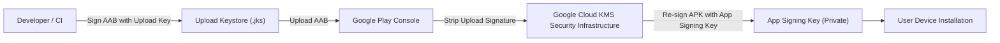

## Play App Signing은 업로드 키와 앱 서명 키를 분리한다

### 내부 메커니즘 (Internal Mechanism)
**Play App Signing(플래이 앱 사이닝)**은 개발자의 키 유실이나 유출로 인한 앱 업데이트 불능 대참사를 방지하기 위해 암호학적 서명 키의 소유 및 관리 역할을 두 개 계층으로 격리 분리하는 구글 플레이의 핵심 보안 구조다:

1. **Upload Key (업로드 키)**: 개발자 개인 PC 또는 사내 CI 빌드 머신 내부 로컬 Keystore(`.jks`)에 보관되는 서명 키다. 개발자가 구글 플레이 콘솔로 AAB 아티팩트를 전송할 때 "이 빌드가 정당한 개발사에 의해 빌드되었음"을 증명하는 인증 용도로만 사용된다. 만약 로컬 업로드 키를 유실하거나 유출하더라도 Google Play Console 지원을 통해 업로드 키를 재발급 및 초기화할 수 있다.
2. **App Signing Key (앱 서명 키)**: 구글의 최고 수준 암호화 물리 인프라인 **Google Cloud KMS (Key Management Service)** 내부 하드웨어 보안 모듈(HSM)에 보관 및 관리되는 최상위 앱 서명 키다. 구글 플레이 서버는 개발자가 전송한 AAB에서 업로드 키 서명을 껍질처럼 제거하고, 타겟 기기별 맞춤 Split APK를 생성한 후 이 **App Signing Key**로 최종 재서명하여 사용자 기기로 전송한다. 따라서 최종 디바이스의 `PackageManager`는 항상 통일된 암호화 키 서명만을 관측하게 된다.



### 코드 예시 (PEPK Tool - Play Encrypted Private Key Export)
```bash
# 기존 KeyStore로부터 Play App Signing용 암호화된 서명 키 추출 명령
java -jar pepk.jar   --keystore=release-keystore.jks   --alias=my-key-alias   --output=encrypted_private_key.pem   --encryptionkey=eb10fe8f7c7c9df715022017b0377e64f46b555430b50715e4a071a550e0f407061c5813e07d7405596b713c186ef7fd102a
```

### 관측 가능 증거 (Observable Evidence)
Play Store에서 다운로드된 APK의 최종 서명 핑거프린트가 로컬 Upload Key 핑거프린트와 상이함을 `apksigner` 도구로 확인할 수 있다:

```bash
apksigner verify --print-certs downloaded-from-play.apk

# Output Example:
# Certificate SHA-256 digest (App Signing Key by Google): 99:AA:BB:CC:... (Local upload key fingerprint와 다름)
```

배경 지식: [신뢰의 기원과 신뢰 사슬](../../../../../security/fundamentals/root-of-trust-and-chain-of-trust.md), [암호화 기술 기초](../../../../../security/fundamentals/cryptography-basics.md)

관련 노트: [Signing config는 로컬 서명과 Play 배포 정체성을 연결한다](../../build/gradle/gradle-build-contracts/signing-config-connects-local-signing-and-play-release-identity.md), [Play 릴리스와 배포 계약](release-distribution-contracts.md)
