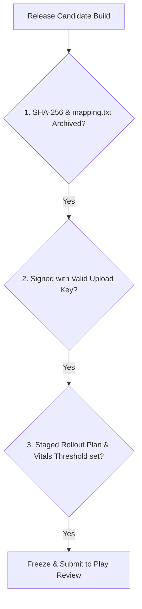

## Play 릴리스 체크리스트는 산출물, 서명, 트랙, 롤백 조건을 고정한다

### 내부 메커니즘 (Internal Mechanism)
상용 릴리스 아티팩트를 전 세계 사용자에게 공식 퍼블리싱하기 직전, 불완전한 바이너리 유입이나 난독화 매핑 유실로 인한 릴리스 사고를 예방하기 위해 다음 4가지 핵심 **릴리스 동결 게이트(Release Freeze Gates)** 조건을 체크리스트로 최종 확정한다:

1. **Artifact Freeze (산출물 동결)**: release 타겟 AAB 파일의 암호학적 **SHA-256 Checksum(해시 무결성 검증)** 생성 및 기록, 그리고 Crashlytics/Retrace용 R8 난독화 매핑 파일(`mapping.txt`)을 릴리스 아카이브로 안전하게 고정 보존한다.
2. **Signature & Version Freeze (서명 및 버전 확정)**: 정식 `versionCode` 및 `versionName`을 확정하고, 지정된 Upload Key로 성공적으로 인코딩 서명되었는지 최종 검증한다.
3. **Track & Rollout Plan (트랙 및 출시 비율 동결)**: 배포 타겟 트랙(Production), 초기 단계적 출시 배포 비율(예: 1%, 5%, 10%), 타겟 언어별 릴리스 노트 텍스트를 최종 고정한다.
4. **Halt / Rollback Criteria (중단 및 롤백 임계선 수립)**: Google Play Console의 공식 품질 모니터링 시스템인 **Android Vitals**의 불량 행동 임계선—사용자 인지 크래시율 1.09% 또는 ANR율 0.47% 초과—발생 시 진행 중인 단계적 출시를 즉각 멈추는 **Halt Rollout** 트리거 조항을 동결 수립한다.



### 코드 예시 (Release Artifact SHA-256 & Mapping Archive Script)
```bash
#!/usr/bin/env bash
set -euo pipefail

AAB_PATH="app/build/outputs/bundle/release/app-release.aab"
MAPPING_PATH="app/build/outputs/mapping/release/mapping.txt"

# 1. SHA-256 해시 생성 및 기록
shasum -a 256 "$AAB_PATH" > RELEASE_AAB_HASH.txt

# 2. Crashlytics / Retrace용 mapping.txt 아카이빙
cp "$MAPPING_PATH" "./release-archives/mapping-$(date +%Y%m%d_%H%M%S).txt"
echo "Release Artifact Checksum & ProGuard Mapping successfully frozen."
```

### 관측 가능 증거 (Observable Evidence)
릴리스 아티팩트 동결 로그 및 생성된 해시 텍스트 출력을 확인할 수 있다:

```bash
cat RELEASE_AAB_HASH.txt

# Output Example:
# e3b0c44298fc1c149afbf4c8996fb92427ae41e4649b934ca495991b7852b855  app-release.aab
```

배경 지식: [암호화 기술 기초](../../../../../security/fundamentals/cryptography-basics.md)

관련 노트: [단계적 출시는 관측 가능한 릴리스 운영 절차다](staged-rollout-is-observable-release-operation.md), [R8 결과물은 크기와 런타임 회귀로 검증한다](../../optimization/build-optimization-contracts/r8-output-must-be-validated-with-size-and-runtime-regression.md)
