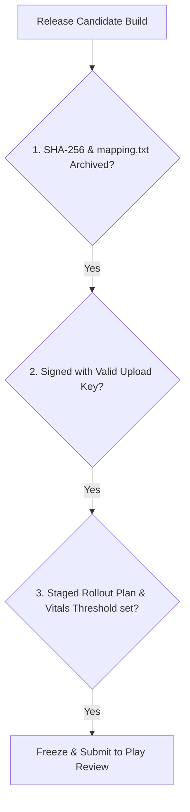

## Play 릴리스 체크리스트는 산출물, 서명, 트랙, 롤백 조건을 고정한다

### 내부 메커니즘 (Internal Mechanism)
상용 릴리스 배포 직전, 불완전한 아티팩트나 설정 오류로 인한 프로덕션 장애를 방지하기 위해 다음 4가지 핵심 릴리스 게이트(Release Freeze Gates)를 최종 동결한다:
1. **Artifact Freeze**: AAB 파일의 무결성 검증 (SHA-256 Hash 고정) 및 `mapping.txt` (ProGuard 디옥스 매핑 파일) 아카이브.
2. **Signature & Version Freeze**: `versionCode` 및 `versionName` 확정, Upload Key 서명 검증.
3. **Track & Rollout Plan**: 배포 트랙(Production), 초기 단계적 출시 비율(1%, 5%, 10%), 타겟 언어별 릴리스 노트 동결.
4. **Halt / Rollback Criteria**: Android Vitals Crash Rate > 1.0% 또는 ANR Rate > 0.47% 초과 시 단계적 출시 즉시 중단(Halt Rollout) 조건 수립.



### 코드 예시 (Release Artifact SHA-256 & Mapping Archive Script)
```bash
#!/usr/bin/env bash
set -euo pipefail

AAB_PATH="app/build/outputs/bundle/release/app-release.aab"
MAPPING_PATH="app/build/outputs/mapping/release/mapping.txt"

# 1. SHA-256 해시 생성 및 기록
shasum -a 256 "$AAB_PATH" > RELEASE_AAB_HASH.txt

# 2. Crashlytics / Retrace용 mapping.txt 아카이빙
cp "$MAPPING_PATH" "./release-archives/mapping-$(date +%Y%m%d_%H%M%S).txt"
echo "Release Artifact Checksum & ProGuard Mapping successfully frozen."
```

### 관측 가능 증거 (Observable Evidence)
릴리스 아티팩트 동결 로그 및 생성된 해시 텍스트 출력을 확인할 수 있다:

```bash
cat RELEASE_AAB_HASH.txt

# Output Example:
# e3b0c44298fc1c149afbf4c8996fb92427ae41e4649b934ca495991b7852b855  app-release.aab
```

관련 노트: [단계적 출시는 관측 가능한 릴리스 운영 절차다](staged-rollout-is-observable-release-operation.md), [R8 결과물은 크기와 런타임 회귀로 검증한다](../../optimization/build-optimization-contracts/r8-output-must-be-validated-with-size-and-runtime-regression.md)
