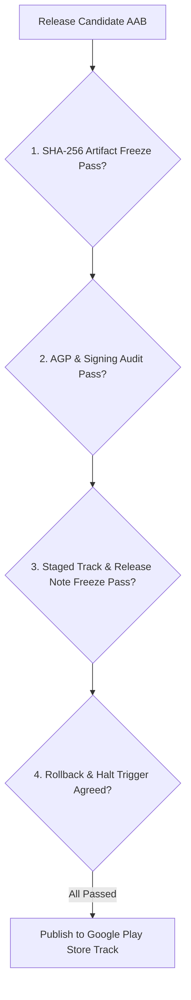

## Play release 체크리스트는 아티팩트, 서명, 트랙, 롤백 조건을 동결한다

상위 문서: [릴리스 배포 계약](release-distribution-contracts.md)

### 개념 및 필요성 (What & Why)
상용 Android 앱의 릴리스 승인 및 배포 최종 단계에서 예기치 않은 배포 사고(배포 직후 전역 크래시 발생, 잘못된 서명 키 사용, 디버그 플래그 유출)를 막기 위한 **Play Release Checklist(릴리스 동결 체크리스트)** 이다.
배포 버튼을 누르기 직전, 아티팩트 해시값, 서명 키 정합성, 배포 트랙, 그리고 크래시 발생 시의 **롤백/배포 중단 조건(Rollback & Halt Conditions)** 을 사전에 엄격히 수립하고 동결해야 한다.

### 내부 메커니즘 (Internal Mechanism)
**릴리스 동결 4대 게이트 체크리스트**:
1. **아티팩트 및 해시 동결 (Artifact Freeze)**: AAB 아티팩트 파일의 SHA-256 해시값을 기록하여 CI에서 생성된 아티팩트와 Play Console에 올라간 아티팩트의 동일성을 보증함.
2. **서명 및 AGP 실효값 검증 (Signing Audit)**: `isDebuggable = false`, `isMinifyEnabled = true`, 릴리스 키스토어 서명 확인.
3. **트랙 및 릴리스 노트 동결 (Track Freeze)**: 게시 타깃 트랙(Internal -> Staged Rollout 10%) 및 다국어 릴리스 노트 정합성 검증.
4. **배포 중단 / 핫픽스 롤백 트리거 수립 (Rollback Trigger)**: 릴리스 후 24시간 이내 Crash-Free User Rate가 98.5% 이하로 하락하거나 비상 ANR 발생 시 배포 즉시 Halt 및 핫픽스 릴리스 선언.



### 코드 예시 (Release Check Verification Command)
```bash
# 릴리스 AAB 아티팩트 SHA-256 핑거프린트 추출 및 동결 예시
shasum -a 256 app/build/outputs/bundle/release/app-release.aab
```

### 관측 가능 증거 (Observable Evidence)
Play Console의 릴리스 대시보드 및 지표 관측 보고서를 통해 배포 동결 조건 만족 여부를 검증할 수 있다:
```bash
bundle exec fastlane run google_play_track_version_codes package_name:"com.example.myapp" track:"production"
```

관련 노트: [Staged rollout은 관측 가능한 배포 작업이다](staged-rollout-is-observable-release-operation.md), [릴리스 배포 계약](release-distribution-contracts.md)
