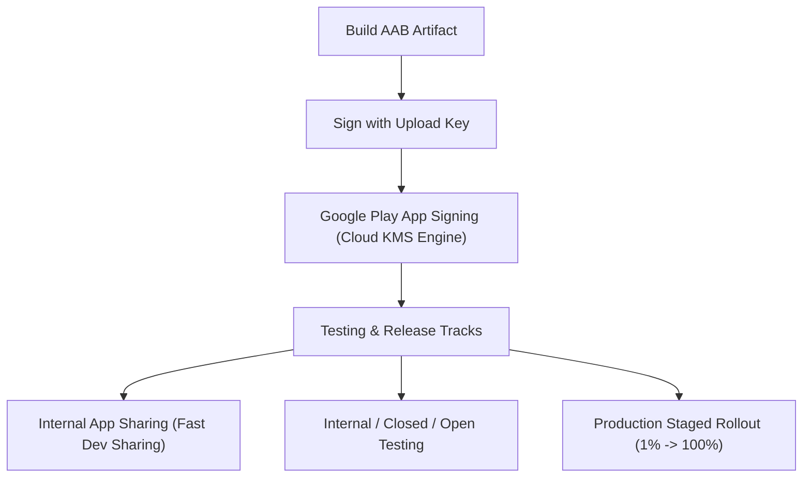

## Play 릴리스와 배포 계약

이 지도는 AAB(Android App Bundle), 앱 업데이트 세 규칙(applicationId, versionCode, 서명), Play App Signing 키 분리 아키텍처, 테스트 트랙 및 내부 앱 공유, 단계적 출시(Staged Rollout), 그리고 Play 릴리스 동결 체크리스트를 다룬다.



### 정본 노트
- [AAB는 Play가 생성하는 APK를 위한 퍼블리싱 아티팩트다](aab-is-publishing-artifact-for-play-generated-apks.md)
- [앱 업데이트는 applicationId, versionCode, 서명 호환성으로 결정된다](app-updates-require-application-id-version-code-and-signature-compatibility.md)
- [Play App Signing은 업로드 키와 앱 서명 키를 분리한다](play-app-signing-separates-upload-key-and-app-signing-key.md)
- [Google Play 테스트 트랙은 배포 대상과 피드백 범위를 나눈다](google-play-testing-tracks-split-audience-and-feedback-scope.md)
- [내부 앱 공유는 릴리스 트랙이 아니라 빠른 아티팩트 공유다](internal-app-sharing-is-fast-artifact-sharing-not-release-track.md)
- [단계적 출시는 관측 가능한 릴리스 운영 절차다](staged-rollout-is-observable-release-operation.md)
- [Play 릴리스 체크리스트는 산출물, 서명, 트랙, 롤백 조건을 고정한다](play-release-checklist-freezes-artifact-signing-track-and-rollback-conditions.md)

관련 지도: [Gradle 빌드 계약](../../build/gradle/gradle-build-contracts/gradle-build-contracts.md), [Play Delivery 계약](../play-delivery-contracts/play-delivery-contracts.md)

### 관측 가능 증거 (Observable Evidence)
```bash
# apksigner 및 bundletool을 사용한 AAB 산출물 서명 및 APK 크기 분석
bundletool get-size total --apks=app.apks
apksigner verify --verbose app-release.apk
```
