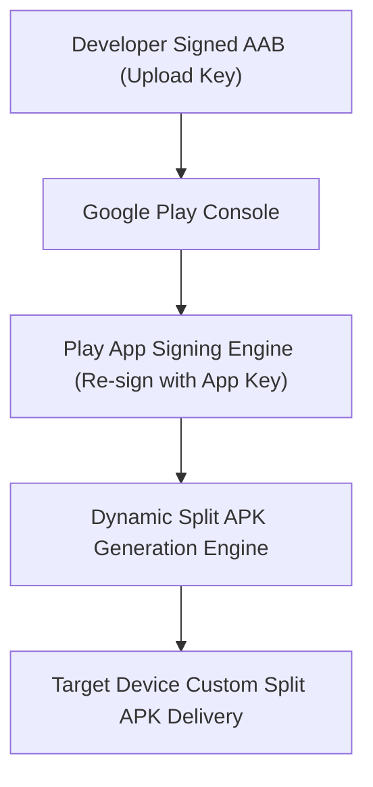

## 릴리스 배포 계약

상위 문서: [Android 패키징과 배포 지도](../../android-packaging-deployment.md)

### 개념 및 필요성 (What & Why)
**릴리스 배포 계약(Release Distribution Contracts)** 은 개발자가 작성한 앱을 최종 엔드 유저 디바이스로 전달하기 위한 Google Play Store 게시, 서명 검증, 버전 호환성, 단계적 롤아웃, 그리고 런타임 앱 업데이트 및 인앱 리뷰의 명세를 정의한다.
단순히 APK 파일을 이메일로 전달하던 시대를 지나 현대 Android 배포 체계는 **AAB(Android App Bundle)** 기반의 분할 APK 배포, Play App Signing 서명 이원화, 트랙 기반 멀티 테스트, 단계적 롤아웃(Staged Rollout)으로 고도화되어 있다.

### 내부 메커니즘 (How / Internal Mechanism)
1. **AAB 배포 규약**: 개발자는 모든 리소스와 DEX가 포함된 `.aab` 아티팩트를 제출하고, Google Play는 사용자 기기의 ABI(arm64-v8a 등), Screen Density(xhdpi 등), 언어 설정에 맞게 최적화된 **Split APK** 세트를 생성하여 맞춤 배포한다.
2. **Play App Signing 기밀 격리**: 개발자가 보유하는 업로드 키(Upload Key)와 Google 서버의 실제 앱 서명 키(App Signing Key)를 분리하여 업로드 키 분실 시에도 계정을 재설정할 수 있게 만든다.
3. **업데이트 상향 호환 계약**: `applicationId` 일치, `versionCode` 단조 증가, 서명 호환성의 3대 조건을 만족해야 기기 내 기존 데이터를 유지하며 업데이트가 이루어진다.
4. **점진적 배포 및 파이프라인 수축**: Staged Rollout(1% -> 5% -> 20% -> 100%)을 통해 실시간 비상 크래시 수치 이상 파악 시 배포를 일시 정지(Halt)할 수 있다.



### 관련 세부 계약 문서
1. [AAB는 Play가 생성하는 APK를 위한 게시 아티팩트다](aab-is-publishing-artifact-for-play-generated-apks.md)
2. [Play app signing은 업로드 키와 앱 서명 키를 분리한다](play-app-signing-separates-upload-key-and-app-signing-key.md)
3. [App 업데이트는 application id, version code, 그리고 서명 호환성을 요구한다](app-updates-require-application-id-version-code-and-signature-compatibility.md)
4. [Google Play 테스트 트랙은 타깃 청중과 피드백 범위를 분리한다](google-play-testing-tracks-split-audience-and-feedback-scope.md)
5. [Internal app sharing은 배포 트랙이 아닌 빠른 아티팩트 공유다](internal-app-sharing-is-fast-artifact-sharing-not-release-track.md)
6. [Staged rollout은 관측 가능한 배포 작업이다](staged-rollout-is-observable-release-operation.md)
7. [In-app update의 flexible과 immediate 흐름은 블로킹에서 차이가 난다](in-app-update-flexible-and-immediate-flows-differ-in-blocking.md)
8. [In-app review API는 리뷰를 요청할 뿐 보장하지 않는다](in-app-review-api-can-only-request-not-guarantee-a-review.md)
9. [Play release 체크리스트는 아티팩트, 서명, 트랙, 롤백 조건을 동결한다](play-release-checklist-freezes-artifact-signing-track-and-rollback-conditions.md)

### 관측 가능 증거 (Observable Evidence)
AAB 내 컴포넌트 구조 및 생성 예정 Split APK 분석은 `bundletool`로 관측할 수 있다:
```bash
bundletool build-apks --bundle=app-release.aab --output=app.apks
```
