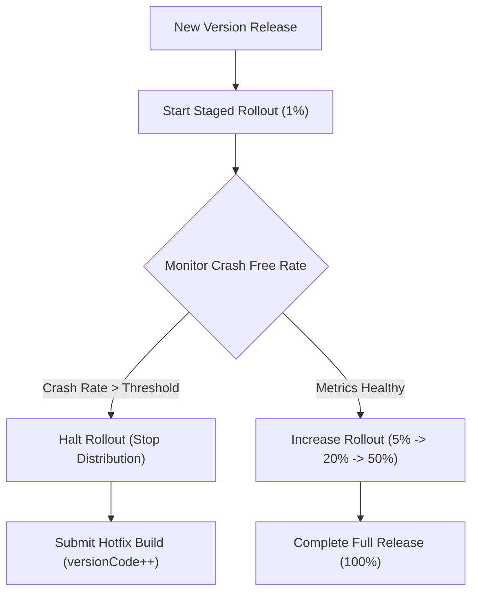

## Staged rollout은 관측 가능한 배포 작업이다

상위 문서: [릴리스 배포 계약](release-distribution-contracts.md)

### 개념 및 필요성 (What & Why)
**Staged Rollout(단계적 롤아웃 / 점진적 배포)** 은 프로덕션 트랙 출시 시 신규 버전을 전체 사용자에게 100% 한 번에 노출하지 않고, 사용자 비율($1\% \rightarrow 5\% \rightarrow 20\% \rightarrow 50\% \rightarrow 100\%$)을 단계적으로 상향 조절하며 출시하는 관측 기반의 배포 전략이다.
아무리 철저히 테스트된 릴리스 아티팩트일지라도, 파편화된 실 디바이스 환경에서 예기치 않은 치명적인 크래시(Crash)나 ANR(App Not Responding)이 유발될 수 있다.
점진적 배포를 적용하면 초기에 소수 사용자층에서 크래시 지표를 실시간 관측(Observability)하여 이상 감지 시 배포를 일시 정지(Halt)시킴으로써 피해를 극소화할 수 있다.

### 내부 메커니즘 (Internal Mechanism)
1. **사용자 롤아웃 무작위 선정**: Google Play 서버가 사용자의 고유 디바이스 토큰 지순으로 지정된 비율만큼 무작위 대상군을 선정한다.
2. **배포 일시 정지(Halt) 및 수정본 게시**:
   - 지표 이상(예: Crash-free user rate < 99%) 관측 시 즉시 `Halt` 버튼을 눌러 추가 업데이트 전파를 차단함.
   - 핫픽스 빌드(`versionCode` 상향)를 제출하면 기존 롤아웃 대상자 및 신규 사용자에게 핫픽스가 배포됨.
3. **Rollout Promotion**: 이상 지표가 없으면 비율을 $20\% \rightarrow 50\% \rightarrow 100\%$로 단계별 클릭 또는 Fastlane API를 통해 높여 배포를 완료함.



### 코드 예시 (Fastlane Staged Rollout Command)
```ruby
# fastlane/Fastfile
lane :staged_release do
  upload_to_play_store(
    track: production,
    rollout: 0.1 # 10% 비율로 점진적 배포 시작
  )
end
```

### 관측 가능 증거 (Observable Evidence)
현재 단계적 롤아웃의 반영 비율 및 진행 상태는 Fastlane 또는 Play Console API로 확인할 수 있다:
```bash
bundle exec fastlane run google_play_track_version_codes package_name:"com.example.myapp" track:"production"
```

관련 노트: [Play release 체크리스트는 아티팩트, 서명, 트랙, 롤백 조건을 동결한다](play-release-checklist-freezes-artifact-signing-track-and-rollback-conditions.md), [릴리스 배포 계약](release-distribution-contracts.md)
