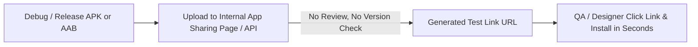

## Internal app sharing은 배포 트랙이 아닌 빠른 아티팩트 공유다

상위 문서: [릴리스 배포 계약](release-distribution.md)

### 개념 및 필요성 (What & Why)
**Internal App Sharing(내부 앱 공유)** 은 QA 팀, 디자이너, PM 등 내부 관계자에게 빌드된 APK/AAB 아티팩트를 전용 링크(URL) 형태로 단 수초 만에 초고속 공유하고 테스트할 수 있게 해주는 Google Play의 개발 도구이다.
많은 개발자가 Internal App Sharing을 Internal Testing Track(내부 테스트 트랙)과 혼동한다.
그러나 **Internal App Sharing은 정식 배포 트랙(Release Track)이 아니다**.
버전 코드 검증, 서명 키 검증, Play 앱 심사 절차를 완전히 우회(Bypass)하므로 디버그 빌드나 이전 버전 빌드도 자유롭게 URL로 올려 수초 만에 테스트할 수 있다.

### 내부 메커니즘 (Internal Mechanism)
1. **규약 우회 (Rule Bypass)**:
   - `versionCode` 단조 증가 규칙 무시 (동일 버전이나 낮은 버전도 공유 가능).
   - 정식 릴리스 서명 키 규칙 무시 (디버그 키스토어 서명본도 테스트 설치 가능).
   - Google Play 심사 스킵.
2. **URL 링크 기반 배포**: AAB/APK 업로드 즉시 전용 딥링크 URL(`https://play.google.com/apps/test/...`)이 생성되며, 링크를 가진 사람만 즉시 다운로드 가능.
3. **QA 일회성 검증 전용**: 정식 버전 트랙으로의 승격(Promotion)은 불가능함.



### 코드 예시 (Fastlane Command)
```ruby
# fastlane/Fastfile
lane :share_build do
  # Internal App Sharing 전용 업로드 액션
  upload_to_play_store_internal_app_sharing(
    aab: app/build/outputs/bundle/debug/app-debug.aab
  )
end
```

### 관측 가능 증거 (Observable Evidence)
업로드 완료 시 생성되는 출력 URL을 통해 아티팩트 설치 가능 상태를 관측할 수 있다:
```bash
bundle exec fastlane run upload_to_play_store_internal_app_sharing aab:"app/build/outputs/bundle/debug/app-debug.aab"
```

관련 노트: [Google Play 테스트 트랙은 타깃 청중과 피드백 범위를 분리한다](google-play-testing-tracks-split-audience-and-feedback-scope.md), [릴리스 배포 계약](release-distribution.md)
