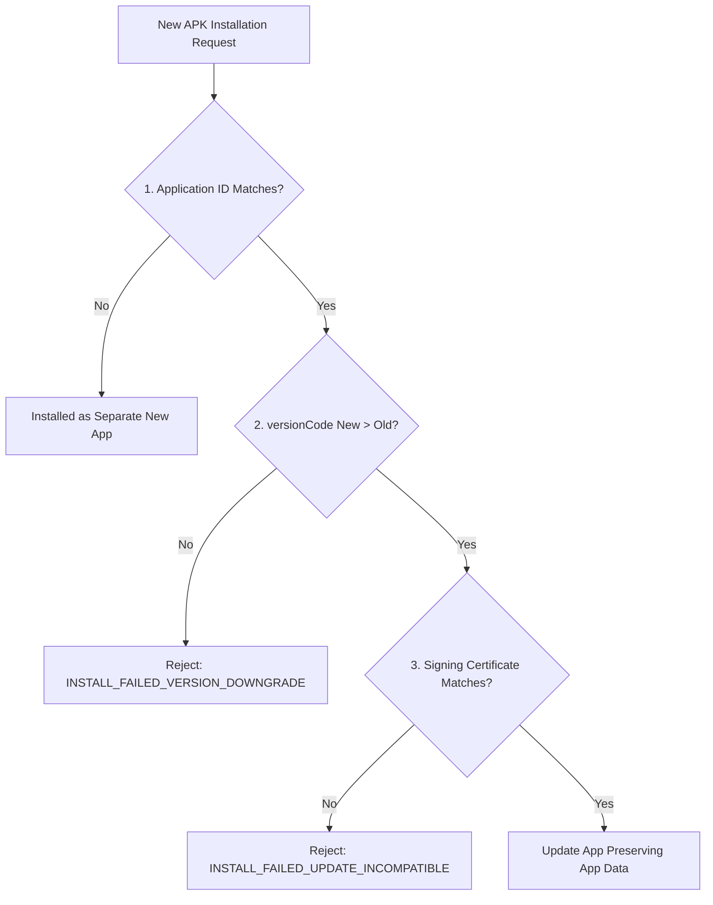

## App 업데이트는 application id, version code, 그리고 서명 호환성을 요구한다

상위 문서: [릴리스 배포 계약](release-distribution.md)

### 개념 및 필요성 (What & Why)
Android OS 및 Google Play 스토어에서 사용자의 스마트폰에 이미 설치된 기존 앱의 데이터를 유지하며 새로운 버전으로 업데이트(Over-The-Air Update)하려면 반드시 **3대 배포 계약 조건**이 만족되어야 한다.
만약 이 중 단 하나라도 호환되지 않으면 Android OS 패키지 매니저는 `INSTALL_FAILED_UPDATE_INCOMPATIBLE` 에러를 반환하며 신규 APK 설치를 단호히 거부한다.

### 내부 메커니즘 (Internal Mechanism)
**안드로이드 앱 업데이트 3대 필수 계약조건**:
1. **Application ID 동일성 (`applicationId`)**: 기존 설치된 앱의 `applicationId`와 새로 설치하려는 앱의 `applicationId`가 정확히 100% 일치해야 함 (문자 하나라도 다르면 별개의 완전히 독립된 앱으로 취급됨).
2. **Version Code 단조 증가 (`versionCode`)**: 신규 앱의 `versionCode` 정수값이 기존에 설치된 앱의 `versionCode`보다 엄격하게 커야 함 ($\text{versionCode}_{\text{new}} > \text{versionCode}_{\text{old}}$). 동일하거나 낮으면 다운그레이드 공격으로 판단하여 rejection 발생.
3. **디지털 서명 호환성 (Certificate Compatibility)**: 새로 설치하려는 APK를 서명한 디지털 인증서(App Signing Key Fingerprint)가 이미 설치된 앱을 서명한 인증서와 일치해야 함 (앱 신뢰성 및 데이터 샌드박스 보안 핵심).



### 코드 예시 (build.gradle.kts & Manifest Check)
```kotlin
// app/build.gradle.kts
android {
    defaultConfig {
        applicationId = "com.example.myapp"
        versionCode = 10002 // 이전 버전(10001)보다 반드시 높은 단조 증가 정수
        versionName = "1.0.2"
    }
}
```

### 관측 가능 증거 (Observable Evidence)
설치된 앱과 신규 APK 간의 `versionCode` 및 인증서 핑거프린트는 `adb` 및 `apkanalyzer`로 관측할 수 있다:
```bash
# 디바이스에 설치된 기존 앱 versionCode 확인
adb shell dumpsys package com.example.myapp | grep versionCode

# 신규 APK의 versionCode 및 서명 인증서 확인
apkanalyzer manifest print new-app.apk | grep "android:versionCode"
```

관련 노트: [AGP defaultConfig 및 앱 식별자·버전 명세](../../build/gradle/agp-default-config.md), [릴리스 배포 계약](release-distribution.md)
