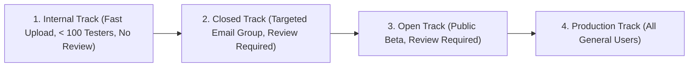

## Google Play 테스트 트랙은 타깃 청중과 피드백 범위를 분리한다

상위 문서: [릴리스 배포 계약](release-distribution.md)

### 개념 및 필요성 (What & Why)

Google Play Console 은 개발자가 상용 프로덕션(Production) 트랙에 앱을 배포하기 전에 다양한 검증 단계별로 대상 사용자를 제한하여 검증할 수 있는 **4 단계 멀티 테스트 트랙(Testing Tracks)** 을 제공한다.

모든 사용자에게 무작치 출시하기 전, 내부 팀, 신뢰할 수 있는 테스터, 일반 참여 테스터 순으로 대상 청중(Audience Scope)을 계층적으로 확대하여 회귀 버그와 사용자 피드백을 수집함으로써 불특정 다수 사용자 대상 검증 위험을 극적으로 낮출 수 있다.

### 내부 메커니즘 (Internal Mechanism)

**Google Play 4 대 배포 트랙의 특성 비교**:

1. **Internal Track (내부 테스트)**:
   - 최대 100 명의 지정된 내부 테스터 대상.
   - Google Play 의 정식 앱 검사(App Review) 과정을 완전히 스킵하거나 극도로 단순화하여 업로드 즉시 몇 분 만에 배포됨.
2. **Closed Track (비공개 테스트)**:
   - 테스터 이메일 리스트 또는 Google 그룹스로 지정된 특정 사용자 그룹 대상. Play 검사 절차 필요.
3. **Open Track (공개 테스트)**:
   - Play 스토어에서 누구나 참여 가능한 테스트 트랙. 검색에는 노출되지만 일반 프로덕션과 분리된 피드백 채널 작동.
4. **Production Track (프로덕션 트랙)**:
   - 전 세계 일반 사용자 대상의 최종 상용 배포 트랙.



### 코드 예시 (Fastlane Supply Track Deployment)
```ruby
# fastlane/Fastfile
lane :deploy_internal do
  upload_to_play_store(
    track: internal, # 내부 테스트 트랙 지정
    aab: app/build/outputs/bundle/release/app-release.aab
  )
end

lane :promote_to_production do
  upload_to_play_store(
    track: internal,
    track_promote_to: production, # 내부 트랙 승인본을 프로덕션으로 즉시 승격
    rollout: 0.1 # 10% 점진적 배포
  )
end
```

### 관측 가능 증거 (Observable Evidence)

Play Console API 연동을 통해 각 트랙에 현재 게재된 아티팩트의 `versionCode` 상태는 Fastlane 연동으로 관측할 수 있다:

```bash
bundle exec fastlane run google_play_track_version_codes package_name:"com.example.myapp" track:"internal"
```

관련 노트: [Internal app sharing은 배포 트랙이 아닌 빠른 아티팩트 공유다](internal-app-sharing.md), [릴리스 배포 계약](release-distribution.md)
