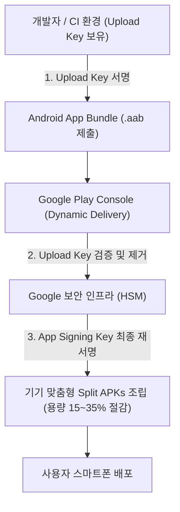

# Play app signing 은 업로드 키와 앱 서명 키를 분리한다

## 1. 개요 (Overview)

**Play App Signing(플레이 앱 서명)** 은 현대 안드로이드 게시 표준인 **AAB(Android App Bundle)** 배포 아티팩트와 결합하여 앱 서명 자격증명의 보안 관리를 개발자 개인이 아닌 Google 의 보안 인프라 서비스로 이관하는 필수 배포 계약이다.

과거 단일 APK 배포 방식에서는 개발자가 단 하나의 키스토어(Keystore)로 서명과 업로드를 모두 처리하여 키 분실 시 앱 업데이트가 영구 불가능해지는 위험이 있었다.

Play App Signing 은 개발자가 사용하는 **업로드 키(Upload Key)** 와 Google Play 가 사용자 기기 배포용 APK 에 서명하는 **앱 서명 키(App Signing Key)** 를 완전 이원화(Separation)하여 이 문제를 근본적으로 해결한다.

---

### 초보자를 위한 쉽게 이해하는 비유

* **Play App Signing (금고 수송 및 최종 인감증명 이원화 체계)**:
  - 개발자가 작성한 원료 상자(AAB)를 구글 본사로 수송할 때는 **배달원 전용 수송용 도장(Upload Key)** 으로 봉인하여 보낸다.
  - 구글 본사(Google Play)는 수송용 도장을 확인한 뒤, 외부 유출이 절대 불가능한 전용 보안 금고(HSM) 속에 보관된 **진짜 사장님의 법인 인감(App Signing Key)** 으로 최종 맞춤 요리(Split APKs)에 재서명하여 손님에게 전달한다.



---

## 2. 내부 메커니즘 (Internal Mechanism)

1. **Upload Key (개발자 보유)**:
   - 개발자/CI 환경에서 AAB 빌드 시 서명하는 용도로만 사용됨. 만약 분실하더라도 Google Play 콘솔 지원을 통해 키 재발급(Reset) 가능.
2. **App Signing Key (Google HSM 보관)**:
   - Google Play 의 보안 HSM(Hardware Security Module) 인프라 내에 영구히 격리 저장됨.
3. **AAB 분할 조립 및 재서명 파이프라인**:
   - 개발자가 Upload Key 로 서명된 AAB 를 제출하면 Google Play 가 Upload Key 서명을 제거한다.
   - 사용자 기기 사양(arm64, xxxhdpi 등)에 맞는 **Base APK + Configuration Split APKs** 를 동적으로 생성하고, Google HSM 의 **App Signing Key** 로 최종 재서명하여 전달한다.

---

## 3. 코드 예시 (`build.gradle.kts` 업로드 키 및 AAB 분할 설정)

```kotlin
// app/build.gradle.kts (업로드 키스토어 및 AAB 분할 활성화)
android {
    signingConfigs {
        create("release") {
            storeFile = file("upload-keystore.jks") // 업로드 키스토어
            storePassword = System.getenv("UPLOAD_KEYSTORE_PASSWORD") ?: ""
            keyAlias = System.getenv("UPLOAD_KEY_ALIAS") ?: ""
            keyPassword = System.getenv("UPLOAD_KEY_PASSWORD") ?: ""
        }
    }
    bundle {
        language.enableSplit = true
        density.enableSplit = true
        abi.enableSplit = true
    }
}
```

---

## 4. 관측 가능 증거 (Observable Evidence)

Play Console 관리 화면의 `설정 > 앱 서명` 메뉴에서 Upload Key 지문과 App Signing Key 지문(SHA-256)이 다르게 관리되는 현황을 확인할 수 있다:

```bash
# Upload Key 정보 검증
keytool -list -v -keystore upload-keystore.jks
```

---

## 5. 연결 문서 (Related Links)

- [릴리스 배포 계약](release-distribution.md) - 상위 릴리스 배포 종합 계약 노드
- [APK (Android Application Package)](../apk.md) - 로컬 직접 설치용 완성형 패키지
- [APK vs AAB 비교](../apk-vs-aab.md) - APK 와 AAB 패키징 규격 및 배포 방식 비교표
