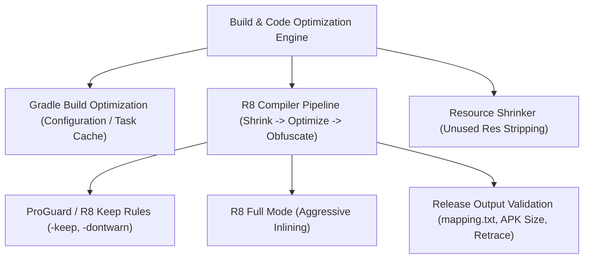

## R8와 Gradle 빌드 최적화 계약

이 지도는 R8 컴파일러 패스(Shrinker, Optimizer, Obfuscator), ProGuard Keep Rules, R8 Full Mode vs Compatibility Mode, Resource Shrinking, 증분 빌드 및 Gradle Build/Configuration Cache, 그리고 빌드 성능 대 런타임 성능 트레이드오프 계약을 다룬다.



### 정본 노트
- [R8은 릴리즈 코드의 수축, 최적화, 난독화를 수행한다](r8-shrinks-optimizes-and-obfuscates-release-builds.md)
- [R8 Full Mode와 Configuration Analyzer는 막힌 최적화를 노출한다](r8-full-mode-and-configuration-analyzer-expose-blocked-optimization.md)
- [Keep 규칙은 최적화 경계다](keep-rules-are-optimization-boundaries.md)
- [리소스 수축은 코드 수축 후 미사용 리소스를 제거한다](resource-shrinking-removes-unused-resources-after-code-shrinking.md)
- [R8 결과물은 크기와 런타임 회귀로 검증한다](r8-output-must-be-validated-with-size-and-runtime-regression.md)
- [증분 빌드, 캐시, 구성 캐시는 빌드 작업량을 줄인다](incremental-build-cache-and-configuration-cache-reduce-build-work.md)
- [Gradle 빌드 성능은 앱 런타임 성능과 다르다](gradle-build-performance-is-not-app-runtime-performance.md)

관련 지도: [Gradle 빌드 계약](../../build/gradle/gradle-build-contracts/gradle-build-contracts.md), [Play 릴리스와 배포 계약](../../distribution/release-distribution-contracts/release-distribution-contracts.md), [Android 성능 및 품질 백서](../../../06_testing_performance/performance/android-performance-quality-and-build-optimization.md)

### 관측 가능 증거 (Observable Evidence)
```bash
# R8 빌드 산출물 매핑 및 시드 파일 관측
ls -la app/build/outputs/mapping/release/
cat app/build/outputs/mapping/release/seeds.txt
```
