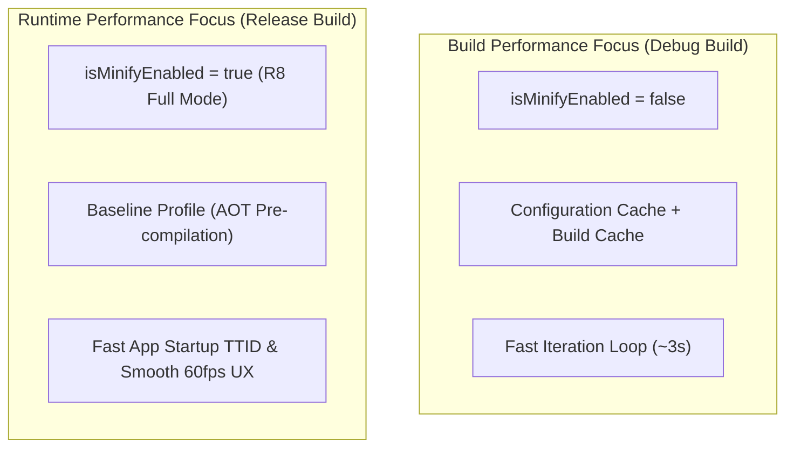

## Gradle 빌드 성능은 앱 런타임 성능과 다르다

### 내부 메커니즘 (Internal Mechanism)
엔지니어링 환경에서 **빌드 시간 성능(Build-Time Performance)**과 **앱 런타임 성능(App Runtime Performance)**은 서로 교환(Trade-off) 관계에 있는 완전히 별개의 축이다:
- **Build Performance (개발 생산성 축)**: 개발자가 코드를 수정하고 컴파일하여 결과를 확인할 때까지의 속도. 증분 컴파일, Build Cache, Configuration Cache, 디버그용 R8 비활성화, DEX 미최적화(`minSdk 21+` 직렬 DEX)를 적용하여 빌드 시간을 단축한다.
- **Runtime Performance (사용자 경험 축)**: 사용자가 앱을 실행하고 화면을 이탈하지 않도록 유지하는 속도. R8 Full Mode 최적화(Class Merging, Inlining), Baseline Profiles (dex2oat AOT 컴파일), 리소스 수축, TTID/TTFD 최적화를 적용한다. R8 최적화를 적용하면 앱 런타임 성능은 최고조에 달하지만 빌드 시간은 크게 증가한다.



### 코드 예시 (gradle.properties & MacrobenchmarkRule)
```properties
# gradle.properties (Build Performance Tuning)
org.gradle.caching=true
org.gradle.configuration-cache=true
org.gradle.parallel=true
org.gradle.jvmargs=-Xmx6g -XX:+UseG1GC
```

```kotlin
// macrobenchmark/StartupBenchmark.kt (App Runtime Performance Measurement)
@RunWith(AndroidJUnit4::class)
class StartupBenchmark {
    @get:Rule
    val benchmarkRule = MacrobenchmarkRule()

    @Test
    fun startupCompilationFull() = benchmarkRule.measureRepeated(
        packageName = "com.example.app",
        metrics = listOf(StartupTimingMetric()),
        compilationMode = CompilationMode.Full(),
        iterations = 5
    ) {
        pressHome()
        startActivityAndWait()
    }
}
```

### 관측 가능 증거 (Observable Evidence)
빌드 프로파일러 결과(Gradle Build Scan)와 앱 런타임 시작 측정 결과(ADB `am start -W`)를 비교하여 두 속성의 차이를 관측할 수 있다:

```bash
# 1. 빌드 성능 관측
./gradlew assembleDebug --profile

# 2. 런타임 성능 관측 (Cold Start TTID)
adb shell am start-activity -W -n com.example.app/.MainActivity

# Output Example:
# Status: ok
# Activity: com.example.app/.MainActivity
# TotalTime: 342ms (TTID - Time To Initial Display)
```

관련 노트: [증분 빌드, 캐시, 구성 캐시는 빌드 작업량을 줄인다](incremental-build-cache-and-configuration-cache-reduce-build-work.md), [R8은 릴리즈 코드의 수축, 최적화, 난독화를 수행한다](r8-shrinks-optimizes-and-obfuscates-release-builds.md)
