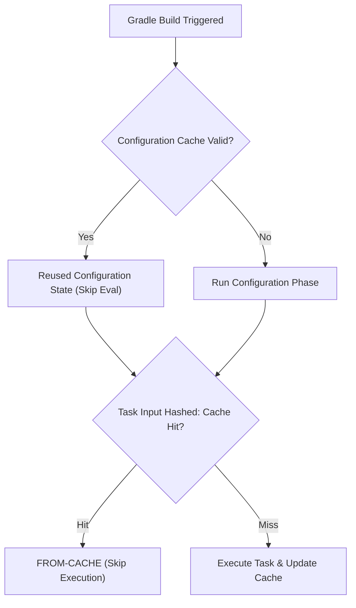

## 증분 빌드, 빌드 캐시, configuration 캐시는 빌드 작업을 줄인다

상위 문서: [빌드 최적화 계약](build-optimization-contracts.md)

### 개념 및 필요성 (What & Why)
개발 타임 빌드 속도를 획기적으로 향상시키는 **Gradle 3대 빌드 최적화 기술**은 다음과 같다:
1. **Incremental Build(증분 빌드)**: 이전 빌드 이후 실제 변경된 파일과 직접적 영향권에 있는 소스 코드만 다시 컴파일하는 기술.
2. **Build Cache(빌드 캐시)**: 동일한 입력(Inputs)에 대해 이전에 이미 수행된 태스크의 출력(Outputs)을 로컬 또는 원격 저장소에서 재사용하여 태스크 연산을 완전 스킵(`FROM-CACHE`)하는 기술.
3. **Configuration Cache(컨피규레이션 캐시)**: Gradle 빌드의 1단계인 Configuration Phase(프로젝트 스크립트 평가 및 DAG 생성 단계) 결과를 디스크에 캡처하여 저장함으로써, 두 번째 빌드부터 Configuration 페이즈 전체를 건너뛰는 기술.

### 내부 메커니즘 (Internal Mechanism)
1. **Task Input/Output Annotation**: `@Input`, `@InputFiles`, `@OutputFile` 어노테이션 기반으로 해시 키(Hash Key)를 산출함.
2. **UP-TO-DATE vs FROM-CACHE**:
   - `UP-TO-DATE`: 현재 로컬 작업 디렉터리에 결과물이 그대로 있어 연산을 생략함.
   - `FROM-CACHE`: 다른 브랜치나 워크스페이스에서 작업한 동일 입력을 빌드 캐시 디렉터리에서 가져옴.
3. **Configuration Cache 시리얼라이제이션**: 빌드 스크립트 객체 그래프를 캡처하므로 Gradle 커스텀 태스크 내에서 `Project` 객체 직접 참조 금지 규칙을 준수해야 함.



### 코드 예시 (gradle.properties)
```properties
# gradle.properties (Gradle 3대 최적화 옵션 활성화)
org.gradle.caching=true
org.gradle.configuration-cache=true
org.gradle.parallel=true
```

### 관측 가능 증거 (Observable Evidence)
빌드 캐시 및 Configuration 캐시 적용 여부는 빌드 실행 로그의 태스크 상태 표기에서 파악할 수 있다:
```bash
./gradlew app:assembleDebug --info | grep -E "UP-TO-DATE|FROM-CACHE|Reusing configuration cache"
```

관련 노트: [빌드 매트릭스와 원격 캐시는 함께 CI 매트릭스 시간을 줄인다](../../build/ci-cd-contracts/build-matrix-and-remote-cache-together-reduce-ci-matrix-time.md), [빌드 최적화 계약](build-optimization-contracts.md)
