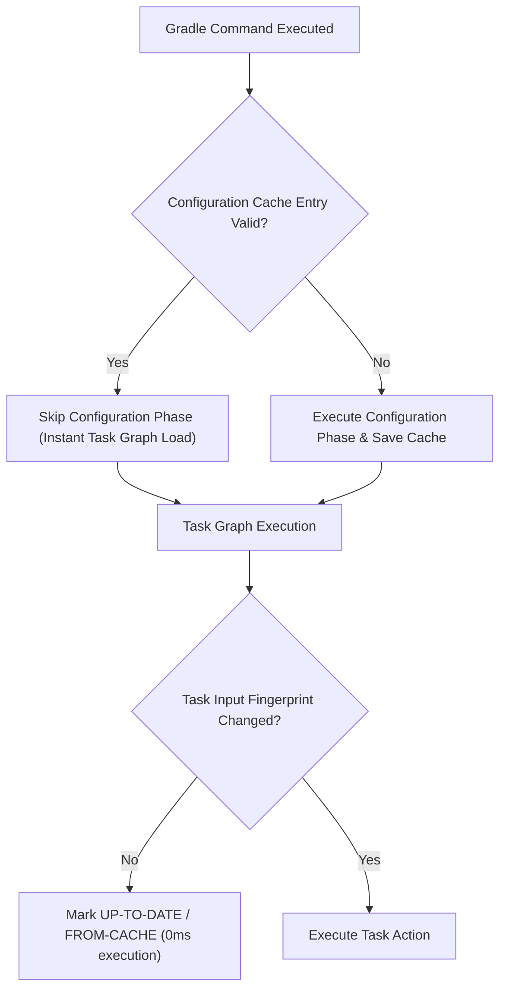

## 증분 빌드, 캐시, 구성 캐시는 빌드 작업량을 줄인다

### 내부 메커니즘 (Internal Mechanism)
Gradle의 빌드 속도 최적화 3대 메커니즘은 불필요한 빌드 작업(Redundant Build Work)을 단계별로 제거한다:
1. **Incremental Build (증분 빌드)**: 태스크의 입력(Input Files, Parameters)과 출력(Output Artifacts)의 해시 핑거프린트를 비교하여 변경이 없는 태스크는 `UP-TO-DATE`로 건너뛴다.
2. **Build Cache (빌드 캐시)**: 다른 브랜치로 전환하거나 다른 CI 머신에서 이미 컴파일된 결과를 로컬/원격 캐시 키 기반으로 재사용한다 (`FROM-CACHE`).
3. **Configuration Cache (구성 캐시)**: `build.gradle.kts` 파일 스크립트를 재해석하고 태스크 그래프를 구성하는 Configuration Phase(보통 3~10초 소요) 전체를 파일로 직렬화하여 재사용한다 (`Reusing configuration cache`).



### 코드 예시 (gradle.properties)
```properties
# gradle.properties
org.gradle.caching=true
org.gradle.configuration-cache=true
org.gradle.configuration-cache.problems=warn
```

### 관측 가능 증거 (Observable Evidence)
Configuration Cache가 활성화된 빌드를 2회 연속 수행했을 때, 두 번째 빌드에서 Configuration Phase가 0초로 단축되는 현상을 관측할 수 있다:

```bash
./gradlew assembleDebug --configuration-cache

# 1st Run Output:
# Configuration cache entry stored.

# 2nd Run Output:
# Reusing configuration cache.
# BUILD SUCCESSFUL in 1s (Configuration phase skipped entirely!)
```

관련 노트: [Gradle 빌드 성능은 앱 런타임 성능과 다르다](gradle-build-performance-is-not-app-runtime-performance.md), [R8와 Gradle 빌드 최적화 계약](build-optimization-contracts.md)
