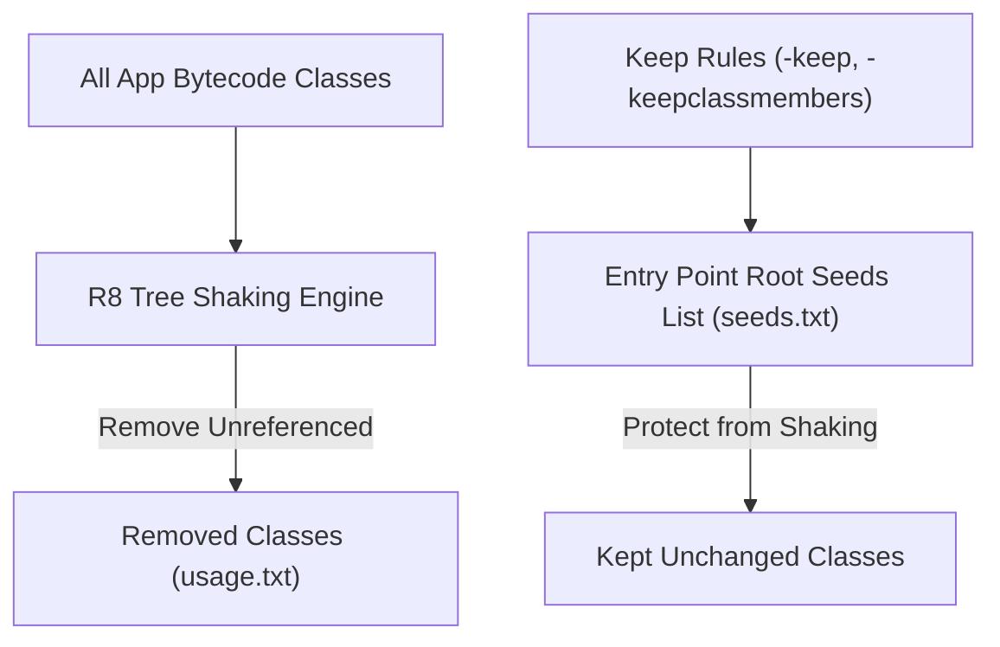

## Keep 규칙은 최적화 경계다

### 내부 메커니즘 (Internal Mechanism)
ProGuard / R8 Keep Rule (`proguard-rules.pro`)은 정적 분석(Static Analysis)을 수행하는 R8 컴파일러 엔진에게 **최적화 금지 경계(Boundary of Non-Optimization)**를 명시하는 룰 선언이다.
런타임 리플렉션(Reflection), JNI 네이티브 C/C++ 바인딩, GSON/Jackson JSON 데시리얼라이제이션 클래스는 코드상에서 직접적인 호출 참조(Direct Reference Root)가 나타나지 않아 R8의 Tree Shaking에 의해 도륙(삭제/난독화)되기 쉽다.
Keep Rule은 이러한 대상들을 R8의 최적화 루트(Entry Point Seeds)로 등록하여 클래스/필드 삭제, 인라이닝, 이름 변경을 방지한다.



### 코드 예시 (proguard-rules.pro)
```proguard
# 1. 런타임 리플렉션 및 JSON 모델 클래스 보호 (-keep)
-keep class com.example.app.data.model.** { *; }

# 2. 특정 어노테이션이 붙은 메서드 보호 (-keepclassmembers)
-keepclassmembers class * {
    @com.example.app.annotation.KeepForReflection <fields>;
    @com.example.app.annotation.KeepForReflection <methods>;
}

# 3. JNI 네이티브 메서드 이름 난독화 방지
-keepclasseswithmembernames,includedescriptorclasses class * {
    native <methods>;
}

# 4. 서드파티 라이브러리 경고 무시
-dontwarn okhttp3.**
```

### 관측 가능 증거 (Observable Evidence)
R8 최적화 완료 후 생성된 `seeds.txt` 파일을 통해 지정한 Keep Rule에 의해 수축 대상에서 제외되어 보호된 클래스 목록을 관측할 수 있다:

```bash
cat app/build/outputs/mapping/release/seeds.txt | grep "com.example.app.data.model"

# Output Example:
# com.example.app.data.model.UserDto
# com.example.app.data.model.UserDto: java.lang.String getName()
```

관련 노트: [R8은 릴리즈 코드의 수축, 최적화, 난독화를 수행한다](r8-shrinks-optimizes-and-obfuscates-release-builds.md), [R8 Full Mode와 Configuration Analyzer는 막힌 최적화를 노출한다](r8-full-mode-and-configuration-analyzer-expose-blocked-optimization.md)
