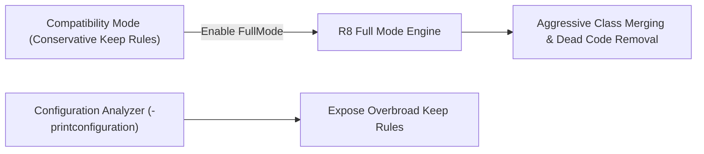

## R8 Full Mode와 Configuration Analyzer는 막힌 최적화를 노출한다

### 내부 메커니즘 (Internal Mechanism)
- **R8 Compatibility Mode (기본 호환 모드)**: 기존 ProGuard의 모호한 동작 방식을 유지하기 위해, 기본 생성자 보유 클래스를 지나치게 광범위하게 keep하는 보수적 최적화를 수행한다.
- **R8 Full Mode (`android.enableR8.fullMode=true`)**: ProGuard 호환성 제약을 제거하고 최적화를 극대화한다. 사용되지 않는 인자 제거, 인터페이스 인라이닝, 더 공격적인 클래스 병합(Class Merging)을 수행한다.
- **Configuration Analyzer**: 라이브러리 AAR 내부에 포함된 Consumer ProGuard Rules 중 광범위한 `-keep class **` 선언으로 전체 R8 최적화를 방해하는 규칙을 찾아내어 노출(Expose Blocked Optimization)시킨다.



### 코드 예시 (gradle.properties & proguard-rules.pro)
```properties
# gradle.properties
android.enableR8.fullMode=true
```

```proguard
# proguard-rules.pro (Configuration Analyzer 출력 설정)
-printconfiguration build/outputs/mapping/release/full_configuration.txt
```

### 관측 가능 증거 (Observable Evidence)
R8 Full Mode 적용 시 병합된 최종 ProGuard 설정 파일(`full_configuration.txt`)을 분석하여 최적화를 방해하는 과도한 keep 규칙을 적발할 수 있다:

```bash
cat app/build/outputs/mapping/release/full_configuration.txt | grep -E "\-keep class \*"

# Output Example (과도한 keep 규칙 적발):
# -keep class com.legacy.library.** { *; }  <-- Consumer ProGuard Rule Optimization Blocked!
```

관련 노트: [Keep 규칙은 최적화 경계다](keep-rules-are-optimization-boundaries.md), [R8 결과물은 크기와 런타임 회귀로 검증한다](r8-output-must-be-validated-with-size-and-runtime-regression.md)
