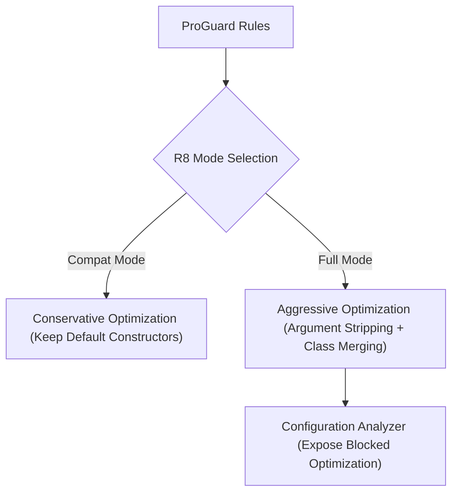

## R8 full mode와 configuration analyzer는 블록된 최적화를 드러낸다

상위 문서: [빌드 최적화 계약](build-optimization-contracts.md)

### 개념 및 필요성 (What & Why)
**R8 Full Mode(풀 모드)** 는 구형 ProGuard의 유산 보수적 동작(Compat Mode)을 탈피하여, 더욱 과감한 최적화(더 강력한 인라이닝, 인자 제거, 정적 클래스 병합)를 수행하는 R8의 기본 작동 모드이다.
과거 호환 모드에서는 남겨지던 모호한 Keep 규칙이나 과도하게 느슨한 와일드카드 규칙(`-keep class com.example.**`)이 존재할 경우 R8 최적화가 무력화될 수 있다.
R8 Configuration Analyzer 및 Full Mode를 활용하면 보수적 규칙에 의해 차단되었던 최적화 공간을 발굴하고 한 단계 더 진화된 수축률을 달성할 수 있다.

### 내부 메커니즘 (Internal Mechanism)
1. **Compat Mode vs Full Mode**:
   - Compat Mode: 클래스가 `-keep`되면 그 안의 Default Constructor까지 자동으로 오버보호함.
   - Full Mode: 명시적으로 요구되지 않은 요소는 서드파티 라이브러리 내부일지라도 엄격하게 수축 및 최적화함.
2. **Aggressive Inlining & Argument Removal**: 사용되지 않는 매개변수 제거 및 단일 호출 클래스 합성 인라이닝을 강력 적용함.
3. **Configuration Analyzer 분석**: 병합된 ProGuard 규칙에서 발생하는 중복 규칙 및 과도한 범위 제한 규칙을 검출함.



### 코드 예시 (gradle.properties)
```properties
# gradle.properties (R8 Full Mode 강제 활성화)
android.enableR8.fullMode=true
```

### 관측 가능 증거 (Observable Evidence)
R8 Full Mode 적용에 따른 규칙 분석 로그는 다음 태스크 빌드로 관측 가능하다:
```bash
./gradlew app:assembleRelease -Dcom.android.tools.r8.showFullTreeShakingTrace=true
```

관련 노트: [R8은 릴리즈 코드의 수축, 최적화, 난독화를 수행한다](r8-shrinks-optimizes-and-obfuscates-release-builds.md), [빌드 최적화 계약](build-optimization-contracts.md)
