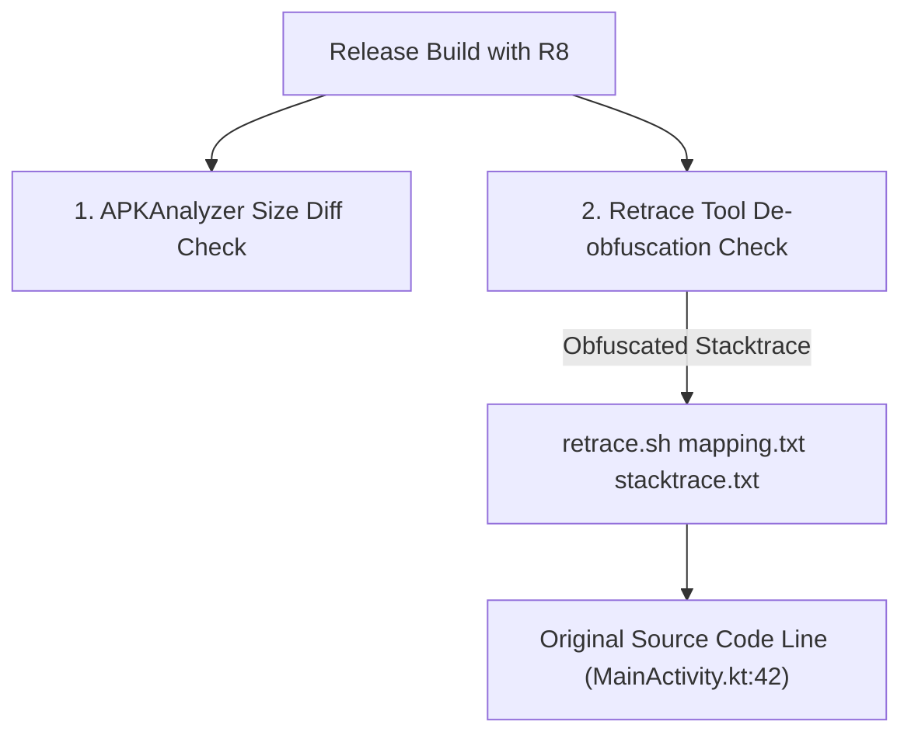

## R8 결과물은 크기와 런타임 회귀로 검증한다

### 내부 메커니즘 (Internal Mechanism)
R8 최적화 패스가 적용된 Release 빌드 산출물은 최종 출시 전 **바이너리 용량 검증(Size Diff Validation)**과 **런타임 회귀 검증(Runtime Crash Regression Test)**을 수반해야 한다.
1. **Size Diff Validation**: `apkanalyzer` CLI 도구를 활용해 이전 릴리스 대비 DEX 파일, assets, res 폴더의 크기 변동 수치를 측정한다.
2. **Obfuscation StackTrace Retrace**: R8 난독화로 인해 `a.b.c.a(Unknown Source)` 형태로 깨진 런타임 스택 트레이스를 `mapping.txt` 기호 파일과 `retrace` 도구를 이용해 원본 Kotlin 소스 코드 라인으로 역복원(De-obfuscation) 가능한지 검증한다.



### 코드 예시 (Retrace CLI Execution Script)
```bash
#!/usr/bin/env bash

# Retrace Execution Command for Crash Log De-obfuscation
$ANDROID_HOME/cmdline-tools/latest/bin/retrace   app/build/outputs/mapping/release/mapping.txt   crash_stacktrace.txt   > retrace_result.txt
```

### 관측 가능 증거 (Observable Evidence)
R8 난독화 스택트레이스가 `retrace` 도구에 의해 완전한 원본 소스 코드 위치로 역복원되는 결과를 관측할 수 있다:

```bash
cat retrace_result.txt

# Retrace Output Example:
# Caused by: java.lang.NullPointerException
#   at com.example.app.ui.main.MainActivity.onDataLoaded(MainActivity.kt:84)
#   at com.example.app.ui.main.MainViewModel.fetchData(MainViewModel.kt:42)
```

관련 노트: [Play 릴리스 체크리스트는 산출물, 서명, 트랙, 롤백 조건을 고정한다](../../distribution/release-distribution-contracts/play-release-checklist-freezes-artifact-signing-track-and-rollback-conditions.md), [R8은 릴리즈 코드의 수축, 최적화, 난독화를 수행한다](r8-shrinks-optimizes-and-obfuscates-release-builds.md)
