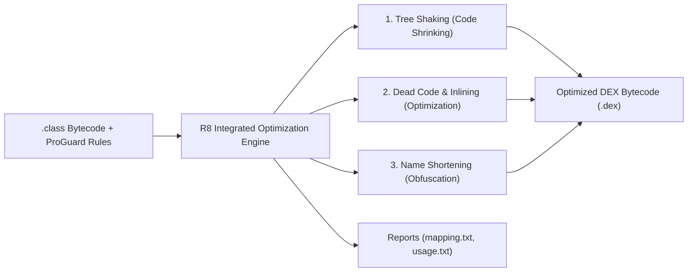

## R8은 릴리즈 코드의 수축, 최적화, 난독화를 수행한다

상위 문서: [빌드 최적화 계약](build-optimization-contracts.md)

### 개념 및 필요성 (What & Why)
**R8** 은 Google이 개발한 차세대 Android 빌드 최적화 컴파일러 엔진이다. 과거 ProGuard(코드 난독화 도구)와 D8(DEX 변환기)로 분리되어 있던 두 단계를 단일 컴파일 파이프라인으로 통합했다.
릴리스 빌드 시 **R8** 은 3가지 핵심 작업을 동시에 수행한다:
1. **Code Shrinking (코드 수축)**: 앱 및 포함된 모든 서드파티 라이브러리에서 실제로 도달 가능(Reachable)하지 않은 미사용 클래스, 필드, 메서드를 제거하여 DEX 크기와 앱 용량을 극적으로 축소한다.
2. **Code Optimization (코드 최적화)**: 데드 코드 제거, 인라이닝(Inlining), 인자 제거, 클래스 계층구조 단순화(Class Merging)를 수행하여 ART 가상 머신에서의 런타임 실행 속도를 향상시킨다.
3. **Obfuscation (난독화)**: 클래스, 메서드, 필드 이름을 `a`, `b`, `c` 등 의미 없는 짧은 식별자로 치환하여 앱 역공학(Reverse Engineering)을 어렵게 만든다.

### 내부 메커니즘 (Internal Mechanism)
R8은 도달 가능성 그래프 분석(Tree Shaking)을 기반으로 작동하며 4가지 출력 보고서 파일(`build/outputs/mapping/release/`)을 생성한다:
- `mapping.txt`: 난독화 이전 원본 식별자와 난독화된 식별자 간의 매핑 테이블 (Play Console 덤프 복원용).
- `seeds.txt`: `-keep` 규칙에 의해 제거 또는 난독화에서 면제된 Entry Point 심볼 목록.
- `usage.txt`: R8에 의해 미사용 판정을 받아 완전히 제거된 클래스 및 메서드 목록.
- `configuration.txt`: 모든 ProGuard 규칙이 병합 적용된 최종 실효 규칙.



### 코드 예시 (build.gradle.kts)
```kotlin
// app/build.gradle.kts
android {
    buildTypes {
        getByName("release") {
            isMinifyEnabled = true // R8 코드 수축/최적화/난독화 활성화
            proguardFiles(
                getDefaultProguardFile("proguard-android-optimize.txt"),
                "proguard-rules.pro"
            )
        }
    }
}
```

### 관측 가능 증거 (Observable Evidence)
R8에 의해 난독화 및 수축된 결과 및 제거된 메서드 목록은 `usage.txt` 파일로 관측할 수 있다:
```bash
head -n 20 build/outputs/mapping/release/usage.txt
```

관련 노트: [Keep 규칙은 최적화 경계다](keep-rules-are-optimization-boundaries.md), [Resource shrinking은 코드 수축 이후 미사용 리소스를 제거한다](resource-shrinking-removes-unused-resources-after-code-shrinking.md), [빌드 최적화 계약](build-optimization-contracts.md)
