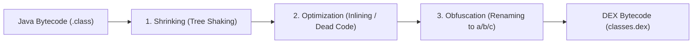

## R8은 릴리즈 코드의 수축, 최적화, 난독화를 수행한다

### 내부 메커니즘 (Internal Mechanism)
R8은 Android Gradle Plugin에 통합된 차세대 컴파일러 엔진으로, Java 바이트코드를 DEX 코드로 변환함과 동시에 3단계 최적화를 단일 통과(Single-Pass)로 수행한다:
1. **Shrinking (수축 / Tree Shaking)**: 진입점(Entry Points: Manifest Activity, Application, Keep Rules)부터 도달할 수 없는 모든 클래스, 필드, 메서드, 어노테이션 코드를 그래프 탐색하여 제거한다.
2. **Optimization (최적화)**: 미사용 함수 인자 제거, 단일 구현 인터페이스 인라이닝(Class Inlining), 람다 합성 축소, 데드 코드 제거(Dead Code Elimination)를 수행한다.
3. **Obfuscation (난독화)**: 클래스, 메서드, 필드 이름을 `a`, `b`, `c` 등 의미 없는 짧은 문자열로 변경하여 리버스 엔지니어링을 방지하고 DEX 용량을 줄인다.



### 코드 예시 (build.gradle.kts)
```kotlin
// app/build.gradle.kts
android {
    buildTypes {
        getByName("release") {
            isMinifyEnabled = true // R8 활성화
            isShrinkResources = true // Resource Shrinker 활성화
            proguardFiles(
                getDefaultProguardFile("proguard-android-optimize.txt"),
                "proguard-rules.pro"
            )
        }
    }
}
```

### 관측 가능 증거 (Observable Evidence)
R8 수행 결과 생성된 4가지 핵심 아티팩트 산출물(`mapping.txt`, `seeds.txt`, `usage.txt`, `configuration.txt`)의 존재와 용량을 확인할 수 있다:

```bash
ls -lh app/build/outputs/mapping/release/

# Output Example:
# -rw-r--r-- 1 dev dev 1.2M Aug 04 15:00 mapping.txt       (Obfuscation mapping)
# -rw-r--r-- 1 dev dev 340K Aug 04 15:00 seeds.txt         (Kept entry points)
# -rw-r--r-- 1 dev dev 890K Aug 04 15:00 usage.txt         (Removed dead code list)
# -rw-r--r-- 1 dev dev  45K Aug 04 15:00 configuration.txt (Merged ProGuard rules)
```

관련 노트: [Keep 규칙은 최적화 경계다](keep-rules-are-optimization-boundaries.md), [리소스 수축은 코드 수축 후 미사용 리소스를 제거한다](resource-shrinking-removes-unused-resources-after-code-shrinking.md)
