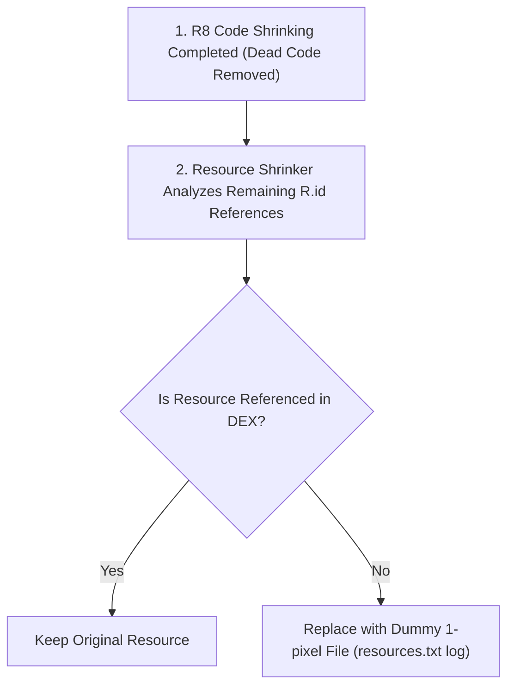

## 리소스 수축은 코드 수축 후 미사용 리소스를 제거한다

### 내부 메커니즘 (Internal Mechanism)
AGP Resource Shrinker (`isShrinkResources = true`)는 독립적으로 동작하지 않으며 반드시 **R8 코드 수축(Code Shrinking)이 완료된 후** 실행된다.
R8이 미사용 자바/코틀린 코드를 제거하면 해당 코드 내의 `R.layout.*`나 `R.drawable.*` 필드 참조도 함께 사라진다. Resource Shrinker는 남아있는 DEX 바이트코드 및 XML 매니페스트를 도달 가능성 그래프(Reachability Graph)로 분석하여 어떤 코드에서도 참조되지 않는 리소스 파일(PNG, XML, Drawables)을 적발한다.
제거 대상 리소스는 완전 삭제되거나, 앱 런타임 `ResourcesNotFoundException` 방지를 위해 **더미 1픽셀 파일 또는 더미 빈 파일**로 대체된다. (Strict Mode 설정 시 실제 파일 바이너리 제거)



### 코드 예시 (keep.xml for Dynamic Resource Prevention)
```xml
<!-- res/raw/keep.xml -->
<!-- Resources.getIdentifier() 동적 접근 리소스의 강제 보호 설정 -->
<resources xmlns:tools="http://schemas.android.com/tools"
    tools:keep="@layout/dynamic_banner_*,@drawable/icon_category_*"
    tools:shrinkMode="strict" />
```

### 관측 가능 증거 (Observable Evidence)
Resource Shrinker가 남긴 리포트 로그 파일(`resources.txt`)을 분석하여 미사용으로 간주되어 더미로 대체되거나 수축된 리소스 내역을 확인할 수 있다:

```bash
cat app/build/outputs/mapping/release/resources.txt | grep "Skipping unused resource"

# Output Example:
# Skipping unused resource res/drawable/unused_logo.png: 245120 bytes -> replaced with 67 bytes dummy PNG.
```

관련 노트: [R8은 릴리즈 코드의 수축, 최적화, 난독화를 수행한다](r8-shrinks-optimizes-and-obfuscates-release-builds.md), [Keep 규칙은 최적화 경계다](keep-rules-are-optimization-boundaries.md)
