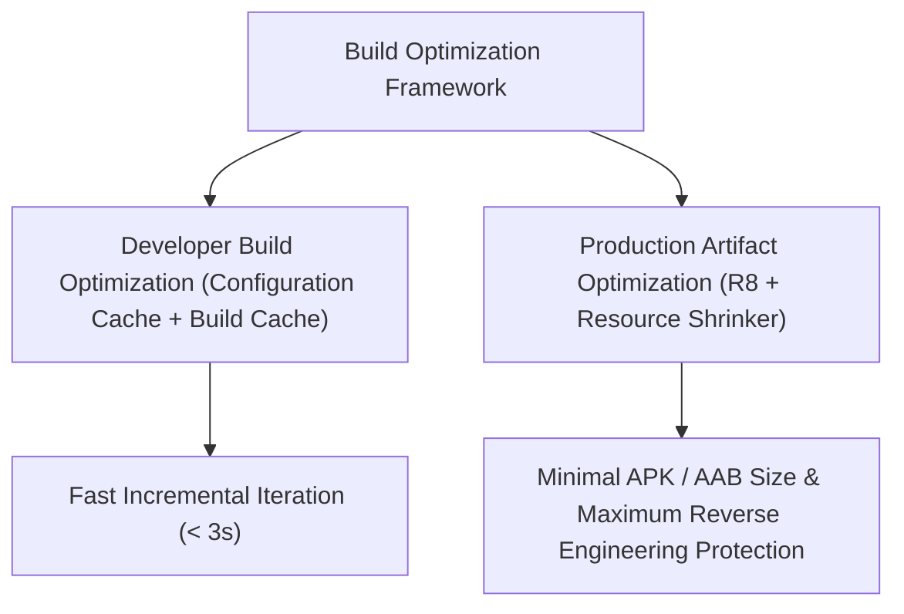

## 빌드 최적화 계약

상위 문서: [Android 패키징과 배포 지도](../android-packaging-deployment.md)

### 개념 및 필요성 (What & Why)
**빌드 최적화 계약(Build Optimization Contracts)** 은 Android 애플리케이션의 개발 생산성(개발자 빌드 속도)과 최종 출시 아티팩트의 성능(앱 용량 최소화, 실행 속도 최적화, 릴리스 보안 난독화)을 동시에 극대화하기 위한 구조적 규칙이다.
개발자 경험(Developer Experience) 관점에서의 빠른 증분 빌드 및 캐싱과, 프로덕션 사용자 관점에서의 R8 코드/리소스 수축 및 난독화는 구별되어 최적화되어야 한다.

### 내부 메커니즘 (How / Internal Mechanism)
1. **R8 최적화 컴파일러 엔진**: 자바 바이트코드를 DEX로 변환할 때 미사용 코드 제거(Code Shrinking), 데드 코드 최적화(Optimization), 클래스/메서드 난독화(Obfuscation)를 통합 단일 단계로 실행한다.
2. **Resource Shrinking**: R8 코드 수축 이후 도출된 도달 가능 도메인 그래프를 바탕으로, 참조되지 않는 XML 및 이미지 아셋을 AAPT2와 협력하여 아티팩트에서 제거한다.
3. **ProGuard Keep Rules**: 리플렉션, JNI native 메서드, `kotlinx.serialization` 직렬화 객체 등 R8에 의해 오진 제거될 수 있는 클래스에 대해 유지 경계(Keep Boundary)를 형성한다.
4. **Gradle 빌드 성능 최적화**: Configuration Cache, Task Output Caching, Incremental Compilation을 통해 개발 타임 컴파일 재작업을 최소화한다.



### 관련 세부 계약 문서
1. [빌드 성능과 런타임 성능의 트레이드오프](build-vs-runtime-performance.md)
2. [Gradle 캐싱 및 빌드 최적화](../build/gradle/gradle-caching-and-optimization.md)
3. [D8과 R8 컴파일러 및 덱싱(Dexing) 메커니즘](d8-and-r8.md)
4. [ProGuard의 본질과 R8과의 관계](proguard.md)
5. [R8 리소스 수축과 keep.xml 관리](r8-resource-shrinking.md)
6. [R8 Keep 규칙과 최적화 경계](r8-keep-rules.md)
7. [R8 Full Mode와 Configuration Analyzer](r8-full-mode.md)
8. [R8 릴리스 검증과 De-obfuscation](r8-validation.md)

### 관측 가능 증거 (Observable Evidence)
R8 최적화 보고서(`usage.txt`, `seeds.txt`, `mapping.txt`)와 APK 용량 절감 분석은 `apkanalyzer` 도구로 관측할 수 있다:
```bash
apkanalyzer apk summary build/outputs/apk/release/app-release.apk
```
