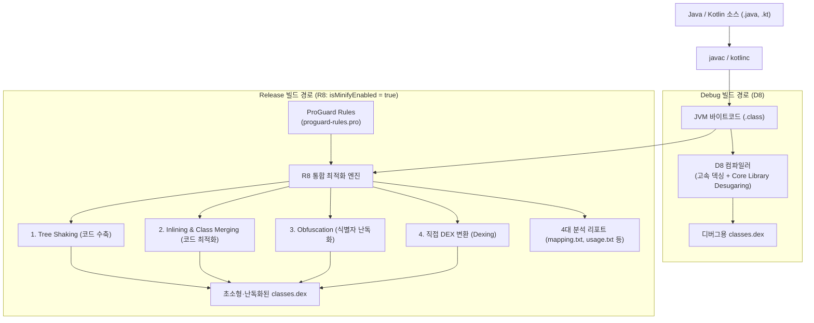

## D8 과 R8 컴파일러 및 덱싱(Dexing) 메커니즘

### 개요

Android 빌드 파이프라인에서 **덱싱(Dexing)** 이란 Java/Kotlin 컴파일러가 생성한 표준 JVM 바이트코드(`.class`)를 Android 런타임(ART/Dalvik)이 실행할 수 있는 레지스터 기반의 **`.dex` (Dalvik Executable) 바이너리 포맷**으로 변환하는 컴파일 과정이다.

Google 은 덱싱과 코드 최적화 성능을 극대화하기 위해 **D8(고속 DEX 컴파일러 및 디슈가링 엔진)** 과 **R8(코드 수축·최적화·난독화·덱싱을 단일 패스로 처리하는 통합 차세대 컴파일러)** 을 표준 도구로 제공한다.



---

### 1. 덱싱(Dexing)이란 무엇이며, 왜 필요한가?

>**"Android 기기는 JVM 바이트코드(`.class`)를 직접 실행하지 못하며, 모바일 하드웨어에 최적화된 `.dex` 포맷만을 실행할 수 있다."**

| 비교 항목 | JVM 표준 바이트코드 (`.class`) | Android 런타임 바이너리 (`.dex`) |
|---|---|---|
| **실행 가상 머신** | 표준 JVM (HotSpot 등) | **Android ART (Android Runtime)** / Dalvik |
| **가상 머신 구조** | **스택 기반 (Stack-based)** (피연산자 스택 사용) | **레지스터 기반 (Register-based)** (가상 레지스터 사용) |
| **상수 풀(Constant Pool)** | 각 `.class` 파일마다 독립된 상수 풀 소유 (극심한 중복) | **전체 앱의 모든 클래스가 단일 상수 풀을 공유 (중복 제거)** |
| **파일 구조** | 1 개 클래스 = 1 개 `.class` 파일 (수천 개 분산) | **수천 개의 클래스가 단 하나의 `classes.dex` 로 압축 통합** |
| **메모리 및 I/O 효율** | 데스크톱/서버용 (메모리 사용량 큼) | **모바일 최적화 (RAM 절약, 캐시 지역성 향상, 빠른 검증)** |

---

### 2. 안드로이드 덱싱 컴파일러의 진화사 (`dx` ➔ `D8` ➔ `R8`)

```text
[과거 레거시: 4단계 분리 파이프라인]
.class ➔ [ProGuard: 코드 수축/난독화] ➔ .class ➔ [dx: 레거시 덱싱] ➔ .dex
  - 문제점: 각 단계마다 바이트코드를 읽고 쓰는 I/O 오버헤드, 느린 빌드 속도, 높은 메모리 소모.

[중간 과도기: D8 도입]
.class ➔ [ProGuard: 코드 수축/난독화] ➔ .class ➔ [D8: 차세대 고속 덱싱] ➔ .dex
  - 개선점: dx 대비 덱싱 속도 2배 이상 향상, 바이트코드 크기 축소.

[현대 표준: R8 단일 패스(Single-pass) 통합 파이프라인]
.class + ProGuard Rules ➔ [ R8: 수축 + 최적화 + 난독화 + 덱싱 통합 ] ➔ .dex
  - 혁신: 중간 .class 재생성 없이 메모리 상에서 직접 .dex를 출력하여 빌드 속도 극대화 및 최고 수준의 최적화 달성.
```

---

### 3. D8 컴파일러: 초고속 덱싱 및 디슈가링(Desugaring)

**D8**은 주로 **Debug 빌드** 또는 코드 축소가 비활성화된 빌드에서 동작한다:

1. **고속 증분 덱싱(Incremental Dexing)**:
   - 변경된 `.class` 파일만 빠르게 `.dex` 슬라이스로 변환하여 빌드 시간을 단축한다.
2. **코어 라이브러리 디슈가링 (Core Library Desugaring)**:
   - Java 8+ 문법(람다식, Method Reference, 인터페이스 `default` 메서드, `java.time` API 등)을 구버전 안드로이드 OS(`minSdk < 26`)에서도 크래시 없이 실행될 수 있도록, D8 이 컴파일 시점에 하위 호환 바이트코드로 재작성(Backporting)한다.

---

### 4. R8 컴파일러: 4 대 통합 최적화 메커니즘

**R8**은 **Release 빌드(`isMinifyEnabled = true`)** 시 활성화되며, ProGuard 의 모든 기능을 대체하고 덱싱까지 한 번에 수행한다:

1. **Tree Shaking (코드 수축 / Code Shrinking)**:
   - 진입점(Entry Points: `AndroidManifest.xml` 에 등록된 Activity, Service 등)부터 정적 호출 그래프를 추적하여, 도달 불가능한(Unreachable) 미사용 클래스, 메서드, 필드를 완전히 제거한다.
2. **Code Optimization (바이트코드 최적화)**:
   - **Method Inlining**: 호출 비용을 줄이기 위해 짧은 메서드 본문을 호출 지점에 직접 인라이닝.
   - **Class Merging**: 인터페이스 구현체가 1 개뿐이거나 상속 계층이 불필요한 경우 두 클래스를 하나로 병합.
   - **Dead Code Elimination**: 절대 실행되지 않는 `if (false)` 블록 및 미사용 변수 할당 제거.
3. **Obfuscation (식별자 난독화)**:
   - 패키지, 클래스, 메서드, 필드 이름을 `a`, `b`, `c` 등 의미 없는 짧은 문자로 치환하여 APK 크기를 줄이고 역공학(Reverse Engineering)을 방지한다.
4. **Direct DEX Generation (직접 덱싱)**:
   - 최적화된 내부 AST(Abstract Syntax Tree)에서 중간 `.class`를 거치지 않고 직접 `classes.dex` 바이너리를 생성한다.

---

### 5. R8 빌드 산출물 4 대 리포트

R8 이 실행되면 `app/build/outputs/mapping/release/` 디렉터리에 다음 4 가지 핵심 분석 보고서가 생성된다:

| 파일명 | 내용 및 주요 용도 |
|---|---|
| **`mapping.txt`** | 원본 클래스/메서드명과 난독화된 이름 간의 매핑 테이블. (Play Console 에 업로드하여 크래시 난독화 스택 트레이스 복원 시 필수) |
| **`seeds.txt`** | ProGuard Keep 규칙(`-keep`)에 의해 제거되거나 난독화되지 않고 온전히 보존된 진입점 심볼 목록 |
| **`usage.txt`** | R8 의 Tree Shaking 에 의해 미사용으로 판정되어 **실제 APK 에서 완전히 삭제된 클래스 및 메서드 목록** |
| **`configuration.txt`** | AGP 기본 최적화 파일, 라이브러리 내장 AAR 룰, 앱 커스텀 `proguard-rules.pro` 가 모두 병합된 최종 실효 규칙 |

---

### 6. 관측 가능 증거 (Observable Evidence)

DEX 내부의 클래스 구조와 R8 의 최적화 결과는 터미널 명령어로 직접 검증할 수 있다:

```bash
# 1. R8에 의해 삭제된 미사용 메서드 목록 확인
head -n 30 build/outputs/mapping/release/usage.txt

# 2. 최종 DEX 파일 내부의 클래스 및 메서드 개수 관측 (apkanalyzer)
apkanalyzer dex packages build/outputs/apk/release/app-release.apk

# 3. Android SDK dexdump 도구로 DEX 바이트코드 디스어셈블
dexdump -d build/intermediates/dex/release/minifyReleaseWithR8/classes.dex | head -n 40
```

---

### 상위 및 연관 문서

- [Android 빌드 파이프라인과 핵심 빌드 용어 해설](../../build/gradle/gradle-build/android-build-pipeline.md)
- [AGP 릴리스 빌드 점검 체크리스트](../../build/gradle/gradle-build/agp-release-checklist.md)
- [바이트코드 파일(.class)과 아카이브 파일(.jar)의 본질](../../../../../computer-science/jvm-bytecode-and-jar-archive.md)
- [APK vs AAB (안드로이드 배포 규격 비교)](../../apk-vs-aab.md)
- [Keep 규칙은 최적화 경계다](keep-rules-are-optimization-boundaries.md)
- [Resource shrinking은 코드 수축 이후 미사용 리소스를 제거한다](resource-shrinking-removes-unused-resources-after-code-shrinking.md)
