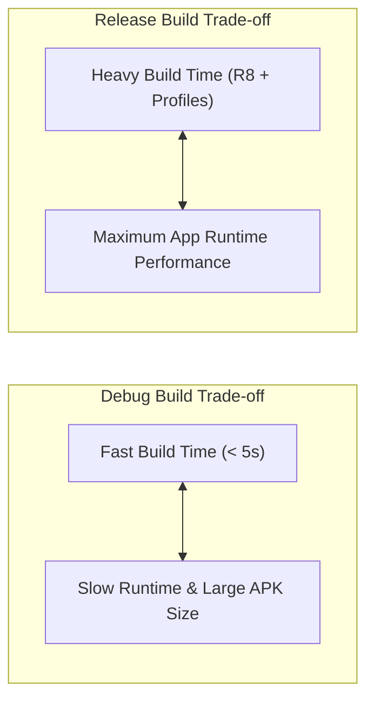

## Gradle 빌드 성능과 앱 런타임 성능은 같지 않다

상위 문서: [빌드 최적화 계약](build-optimization.md)

### 개념 및 필요성 (What & Why)
안드로이드 개발 시 **Gradle 빌드 성능(Build Performance - 개발자 머신에서 컴파일 완료에 걸리는 시간)** 과 **앱 런타임 성능(App Runtime Performance - 실제 사용자의 스마트폰에서 앱이 실행되는 속도 및 메인 스레드 프레임 유지력)** 은 전혀 다른 영역의 성능 트레이드오프(Trade-off) 관계를 가질 수 있다.
예를 들어, 디버그 빌드 시 R8 난독화나 프로필 가이디드 최적화(Baseline Profiles)를 활성화하면 개발자 빌드 시간은 극도로 늘어나지만 런타임 속도는 빨라진다.
반대로 릴리스 빌드 시 빌드 속도 향상을 위해 R8이나 AAPT2 최적화를 끄면, 빌드는 빠르지만 사용자의 폰에서는 앱 용량이 커지고 런타임 성능이 마비된다.
개발 타임 환경과 릴리스 타임 환경의 트레이드오프 목표를 명확히 분리해야 한다.

### 내부 메커니즘 (Internal Mechanism)
1. **Debug Build 목표**: 개발자 빠른 수정-시행 주기를 위한 **최소 빌드 시간** 확보 (R8 비활성화, 멀티덱스 즉시 통합, 패스트 렌더링).
2. **Release Build 목표**: 사용자 만족도와 장치 메모리 절약을 위한 **최고의 런타임 성능 및 용량 최적화** (R8 풀 모드, Baseline Profiles, 리소스 수축 적용).
3. **Gradle Build Scan 측정**: `--profile` 또는 Gradle Build Scan을 통해 빌드 단계별 소요 시간을 계측하고 타깃 튜닝을 수행함.



### 코드 예시 (build.gradle.kts)
```kotlin
// app/build.gradle.kts (빌드 타입별 목적에 맞는 설정 분리)
android {
    buildTypes {
        getByName("debug") {
            isMinifyEnabled = false   // 빌드 속도 우선
            isShrinkResources = false
        }
        getByName("release") {
            isMinifyEnabled = true    // 런타임 성능 및 용량 우선
            isShrinkResources = true
        }
    }
}
```

### 관측 가능 증거 (Observable Evidence)
Gradle 빌드 소요 시간 분석 프로파일링 보고서는 다음 명령어로 생성하여 볼 수 있다:
```bash
./gradlew app:assembleDebug --profile
```

관련 노트: [증분 빌드, 빌드 캐시, configuration 캐시는 빌드 작업을 줄인다](incremental-build-cache-and-configuration-cache-reduce-build-work.md), [빌드 최적화 계약](build-optimization.md)
