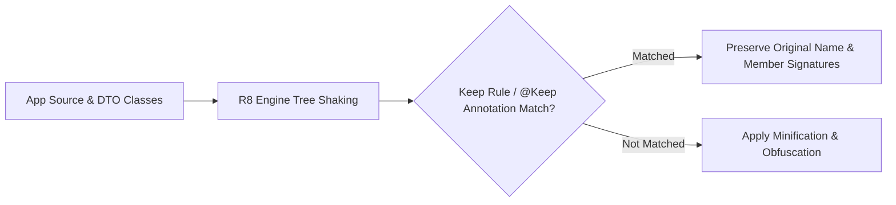

## Keep 규칙은 최적화 경계다

상위 문서: [빌드 최적화 계약](build-optimization.md)

### 개념 및 필요성 (What & Why)
**ProGuard Keep 규칙(ProGuard Keep Rules - `proguard-rules.pro`)** 은 R8 최적화 컴파일러 엔진에게 수축(Shrinking), 최적화, 난독화(Obfuscation) 조치를 명시적으로 제한하도록 지시하는 **최적화 경계(Optimization Boundaries)** 이다.
R8은 컴파일 타임의 정적 호출 그래프만 추적할 수 있으므로, 런타임 자바 리플렉션(Reflection), JNI 네이티브 메서드 호출, `AndroidManifest.xml` 컴포넌트, JSON 데이터 바인딩 DTO 객체 등 정적 참조가 드러나지 않는 코드를 미사용으로 오인하여 삭제할 수 있다.
정확한 Keep 규칙을 지정하여 런타임 릴리스 크래시를 완벽히 예방해야 한다.

### 내부 메커니즘 (Internal Mechanism)
**주요 Keep 규칙 디렉티브 4가지**:
1. `-keep`: 지정된 클래스 및 멤버 전체의 제거, 난독화, 인라이닝을 모두 차단함.
2. `-keepclassmembers`: 클래스 자체는 난독화하되, 내부 특정 멤버(예: 런타임 리플렉션 필드)만 보호함.
3. `-keepclasseswithmembers`: 특정 어노테이션이나 메서드를 가진 클래스들을 선택적 보호함.
4. `@Keep` 어노테이션: `androidx.annotation.Keep`을 소스 코드에 직접 적용하여 ProGuard 파일 작성 없이 경계를 형성함.



### 코드 예시 (proguard-rules.pro)
```proguard
# proguard-rules.pro

# 1. Retrofit / Gson DTO 객체 직렬화 필드 보존
-keepclassmembers class com.example.myapp.data.dto.** {
    <fields>;
}

# 2. JNI 네이티브 C/C++ 호출 메서드 보존
-keepclasseswithmembernames class * {
    native <methods>;
}

# 3. AndroidView 커스텀 뷰 2인자 생성자 보존
-keepclassmembers class * extends android.view.View {
    public <init>(android.content.Context, android.util.AttributeSet);
}
```

### 관측 가능 증거 (Observable Evidence)
R8이 인지하고 보호한 최종 entry point 목록은 다음 보고서 파일에서 관측 가능하다:
```bash
cat build/outputs/mapping/release/seeds.txt | grep "com.example.myapp.data.dto"
```

관련 노트: [R8은 릴리즈 코드의 수축, 최적화, 난독화를 수행한다](r8-shrinks-optimizes-and-obfuscates-release-builds.md), [빌드 최적화 계약](build-optimization.md)
