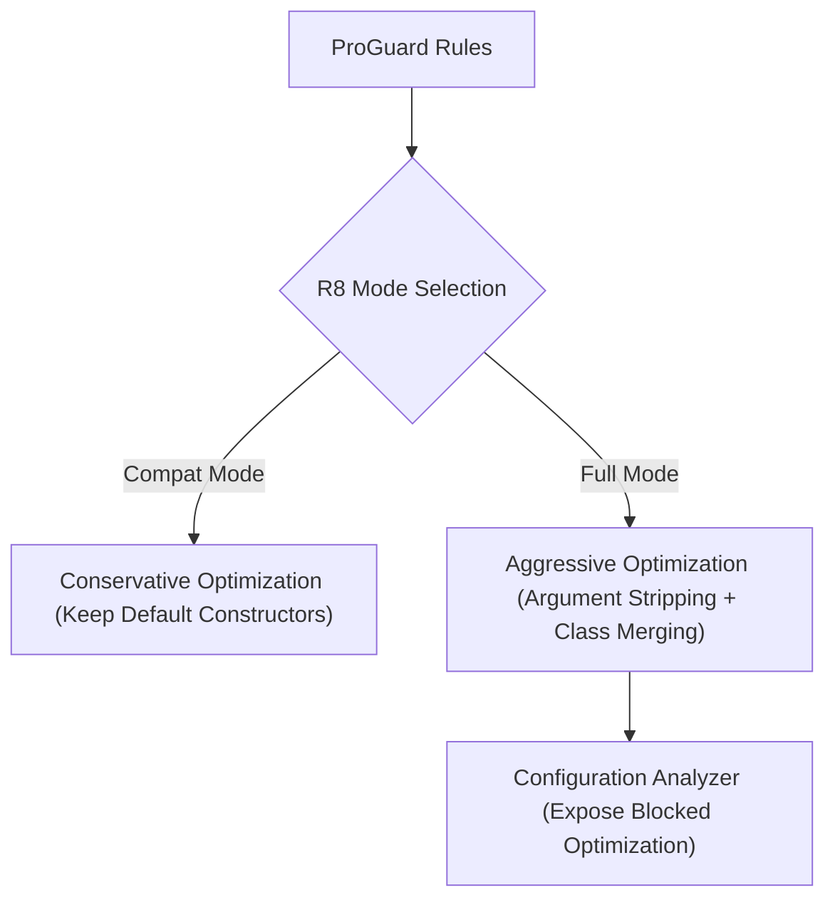

## R8 full mode와 configuration analyzer는 블록된 최적화를 드러낸다

상위 문서: [빌드 최적화 계약](build-optimization.md)

### 개념 및 필요성 (What & Why)
**R8 Full Mode(풀 모드)** 는 compatibility mode보다 강한 수축·최적화를 적용하며 **AGP 8.0부터 기본값**이다. 현대 프로젝트에서 별도 플래그로 켜는 기능이 아니라, 과거 마이그레이션 과정에서 넣은 `android.enableR8.fullMode=false`가 남아 있다면 제거하고 릴리스 테스트로 동작을 확인하는 대상이다.
과거 호환 모드에서는 남겨지던 모호한 Keep 규칙이나 과도하게 느슨한 와일드카드 규칙(`-keep class com.example.**`)이 존재할 경우 R8 최적화가 무력화될 수 있다.
R8 Configuration Analyzer 및 Full Mode를 활용하면 보수적 규칙에 의해 차단되었던 최적화 공간을 발굴하고 한 단계 더 진화된 수축률을 달성할 수 있다.

### 내부 메커니즘 (Internal Mechanism)
1. **Compat Mode vs Full Mode**:
   - Compat Mode: 클래스가 `-keep`되면 그 안의 Default Constructor까지 자동으로 오버보호함.
   - Full Mode: 명시적으로 요구되지 않은 요소는 서드파티 라이브러리 내부일지라도 엄격하게 수축 및 최적화함.
2. **Aggressive Inlining & Argument Removal**: 사용되지 않는 매개변수 제거 및 단일 호출 클래스 합성 인라이닝을 강력 적용함.
3. **Configuration Analyzer 분석**: 병합된 앱·라이브러리 keep rule이 shrinking, optimization, obfuscation을 얼마나 막는지 점수와 규칙별 영향으로 보여 준다. AGP 9.3 이상에서는 전용 Gradle 태스크와 정규 R8 빌드 보고서를 사용할 수 있다.



### 설정 확인
```properties
# AGP 8.0+에서는 full mode가 기본이다.
# 다음 opt-out이 있다면 제거한 뒤 회귀 테스트한다.
# android.enableR8.fullMode=false
```

### 관측 가능 증거 (Observable Evidence)
AGP 9.3 이상에서는 standalone 분석 태스크가 APK/AAB를 만들지 않고 HTML 보고서를 생성한다:
```bash
./gradlew :app:analyzeReleaseR8Config
# app/build/reports/r8/r8-config-analyzer-release.html
```

`assembleRelease` 또는 `bundleRelease` 같은 R8 릴리스 빌드도 `build/outputs/mapping/release/configanalyzer.html`을 생성한다. AGP 9.2 이하에는 전용 태스크가 없으므로 공식 문서의 해당 버전용 system property를 사용해야 하며, 존재하지 않는 진단 플래그를 추정해서 사용하면 안 된다. 보고서에서 넓은 package wildcard, 중복·미사용 규칙을 좁힌 뒤에는 반드시 난독화된 릴리스 아티팩트로 회귀 테스트한다.

관련 노트: [D8과 R8 컴파일러 및 덱싱(Dexing) 메커니즘](d8-and-r8.md), [빌드 최적화 계약](build-optimization.md)

공식 문서: [Use R8 in full mode](https://developer.android.com/topic/performance/app-optimization/full-mode), [Use R8 Configuration Analyzer](https://developer.android.com/topic/performance/app-optimization/r8-configuration-analyzer)

검증일: 2026-08-06. AGP 8.0의 full mode 기본값과 AGP 9.3의 `analyzeReleaseR8Config` 계약을 반영했다.
