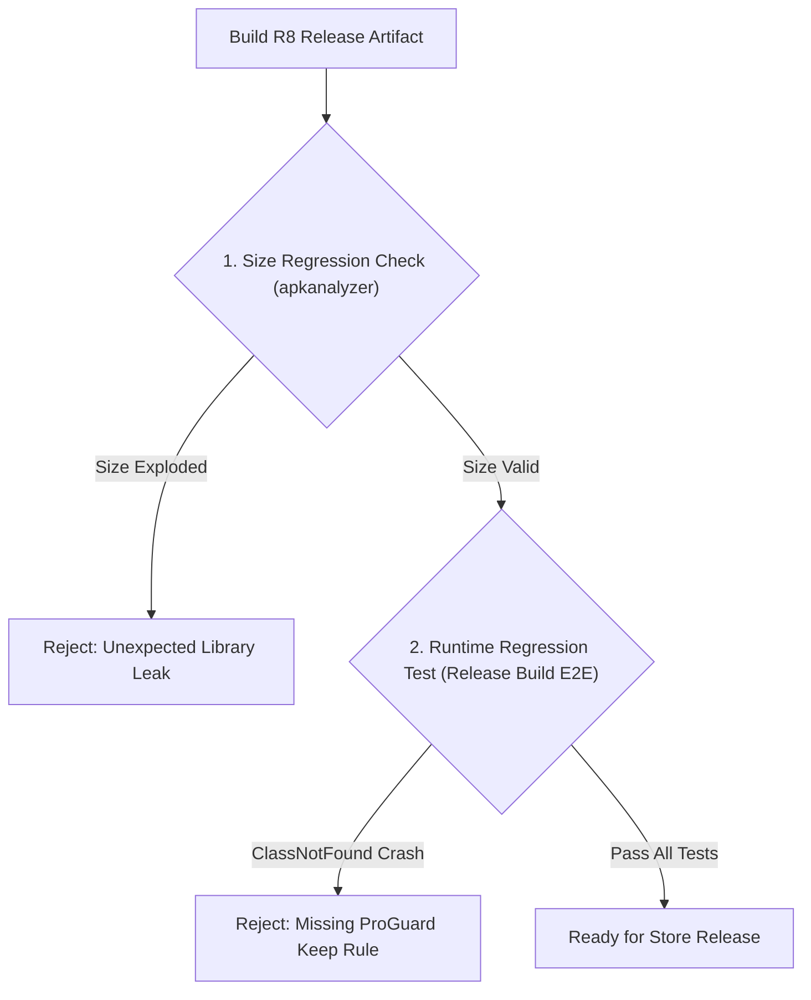

## R8 결과물은 용량 및 런타임 회귀로 검증해야 한다

상위 문서: [빌드 최적화 계약](build-optimization.md)

### 개념 및 필요성 (What & Why)
R8 최적화 컴파일러를 적용한 빌드가 에러 없이 완료되었다고 해서 릴리스 준비가 끝난 것은 아니다.
디버그 빌드에서는 정상 작동하던 앱이 R8 난독화 및 수축 후 런타임에 특정 화면 진입 시 `ClassNotFoundException`이나 `NullPointerException`을 일으키거나, 예기치 못한 라이브러리 추가로 APK 용량이 갑자기 커지는 회귀 현상이 자주 발생한다.
따라서 **R8 산출물은 반드시 용량 검증(Size Diff Audit)과 런타임 회귀 계측 테스트(Runtime Regression Test)로 2중 검증**되어야 한다.

### 내부 메커니즘 (Internal Mechanism)
1. **`apkanalyzer` 이용 용량 계측**: 이전 버전 AAB 대비 DEX 바이트코드 디렉터리, `res` 아셋, `lib` 네이티브 바이너리별 용량 증가율을 추적한다.
2. **Release Variant E2E / Macrobenchmark 회귀 테스트**: R8 수축이 완료된 릴리스 아티팩트에 대해 계측 테스트 수트 및 앱 렌더링 성능(Macrobenchmark) 테스트를 돌려 런타임 크래시 여부를 판별한다.
3. **`mapping.txt` 기밀 보존 및 de-obfuscation**: 크래시 발생 시 Play Console 또는 Crashlytics에 `mapping.txt`를 자동 업로드하여 난독화 스택 트레이스를 원본 소스로 복원한다.



### 코드 예시 (CI Size & Crash Verification Script)
```bash
# APK 용량 및 DEX 메트릭 추출 예시
apkanalyzer apk summary build/outputs/apk/release/app-release.apk
apkanalyzer dex packages build/outputs/apk/release/app-release.apk
```

### 관측 가능 증거 (Observable Evidence)
R8 난독화 덤프 복원 검증은 `retrace` 도구로 관측 및 수행할 수 있다:
```bash
retrace.sh build/outputs/mapping/release/mapping.txt obfuscated_trace.txt
```

관련 노트: [R8은 릴리즈 코드의 수축, 최적화, 난독화를 수행한다](r8-shrinks-optimizes-and-obfuscates-release-builds.md), [빌드 최적화 계약](build-optimization.md)
