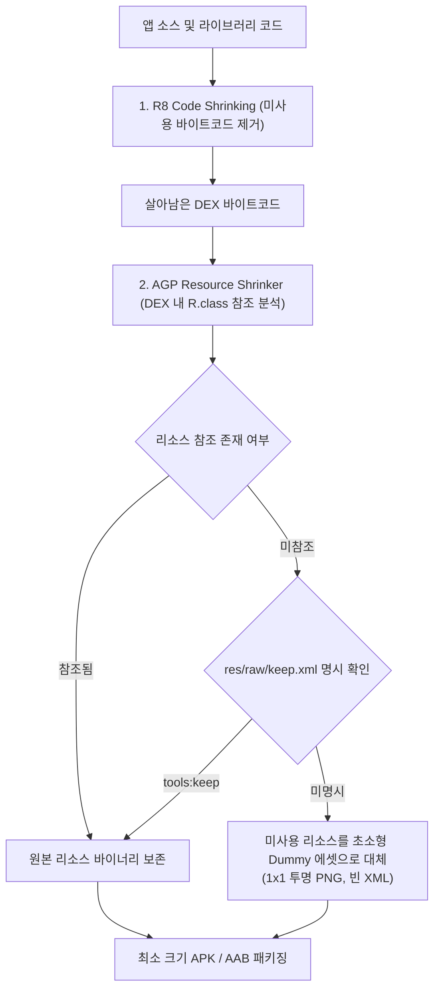

## R8 리소스 수축과 keep.xml 관리 (Resource Shrinking)

### 개요

**Resource Shrinking(리소스 수축 - `isShrinkResources = true`)** 은 AGP 빌드 파이프라인에서 실제 앱 코드에서 참조되지 않는 미사용 XML 레이아웃, 이미지, 드로어블, 원시 리소스(Asset)를 패키징 단계에서 제거하거나 더미화하여 앱 다운로드 크기를 축소하는 최적화 프로세스이다.

리소스 수축은 반드시 **[R8 코드 수축(Code Shrinking)](d8-and-r8.md)이 완료된 이후에 연동 실행**되어야 한다. R8 에 의해 미사용 라이브러리나 기능 코드가 삭제되어야만, 그 코드가 참조하던 전용 리소스 파일들 역시 비참조(Unused) 상태로 식별될 수 있기 때문이다.



---

### 1. 리소스 수축의 내부 동작 메커니즘

1. **DEX 바이트코드 역추적 스캔**:
   - R8 코드 수축이 완료되면, Resource Shrinker 는 살아남은 DEX 파일 전체를 스캔하여 `R.drawable.*`, `R.layout.*`, `R.string.*` 등의 정수형 리소스 ID 사용처를 추적한다.
2. **미사용 리소스 더미화 (Dummy Replacement)**:
   - 미사용 리소스를 `resources.arsc` 테이블에서 물리적으로 완전히 삭제하면 AAPT2 의 정수형 ID 인덱스가 깨질 수 있다.
   - 따라서 Resource Shrinker 는 리소스 엔트리는 유지하되, 실제 파일 바이너리를 **1×1 픽셀 투명 PNG나 아주 작은 빈 XML 더미 파일**로 교체하여 파일 용량을 수 바이트 수준으로 압축한다.

---

### 2. 빌드 스크립트 설정 (`build.gradle.kts`)

```kotlin
// app/build.gradle.kts
android {
    buildTypes {
        getByName("release") {
            isMinifyEnabled = true    // 1. R8 코드 수축 활성화 (필수 선행 조건)
            isShrinkResources = true  // 2. 리소스 수축 활성화
            proguardFiles(
                getDefaultProguardFile("proguard-android-optimize.txt"),
                "proguard-rules.pro"
            )
        }
    }
}
```

> [!WARNING]
> `isShrinkResources = true`는 반드시 `isMinifyEnabled = true`와 함께 선언되어야 한다. 코드 수축 없이 리소스 수축만 단독으로 켜면 빌드 에러가 발생한다.

---

### 3. 동적 리소스 참조와 `res/raw/keep.xml`

런타임에 문자열 이름으로 리소스를 동적 조회하는 경우(`Resources.getIdentifier()`), Resource Shrinker 가 이를 미사용 리소스로 오판하여 더미화할 수 있다. 이를 방지하기 위해 `res/raw/keep.xml`을 선언한다.

```xml
<!-- app/src/main/res/raw/keep.xml -->
<?xml version="1.0" encoding="utf-8"?>
<resources xmlns:tools="http://schemas.android.com/tools"
    tools:keep="@drawable/icon_tier_*, @layout/dynamic_banner_*"
    tools:discard="@layout/legacy_login_screen"
    tools:shrinkMode="strict" />
```

- **`tools:keep`**: 동적으로 로드되는 리소스 패턴을 와일드카드(`*`)로 명시하여 보존.
- **`tools:discard`**: 코드에서 우연히 참조되더라도 강제로 제거할 폐기 대상 리소스 지정.
- **`tools:shrinkMode="strict"`**: 기본 안전 모드(Safe Mode: 문자열 포맷팅 리소스 추정 보존) 대신 엄격 모드를 적용하여 불필요한 추정 보존을 배제.

---

### 4. 관측 가능 증거 (Observable Evidence)

빌드 완료 후 제거되거나 더미화된 리소스 목록은 `resources.txt` 리포트 파일에서 직접 확인할 수 있다:

```bash
# 1. 제거된(더미화된) 미사용 리소스 목록 확인
cat app/build/outputs/mapping/release/resources.txt | grep "Unused resource"

# 2. 살아남은 리소스 엔트리 상태 확인
cat app/build/outputs/mapping/release/resources.txt | grep "Skipped unused resource"
```

---

### 상위 및 연관 문서

- [D8과 R8 컴파일러 및 덱싱(Dexing) 메커니즘](d8-and-r8.md)
- [R8 Keep 규칙과 최적화 경계](r8-keep-rules.md)
- [AGP 릴리스 빌드 점검 체크리스트](../../build/gradle/gradle-build/agp-release-checklist.md)
- [Android 빌드 파이프라인과 핵심 빌드 용어 해설](../../build/gradle/gradle-build/android-build-pipeline.md)
- [빌드 최적화 계약](build-optimization.md)
