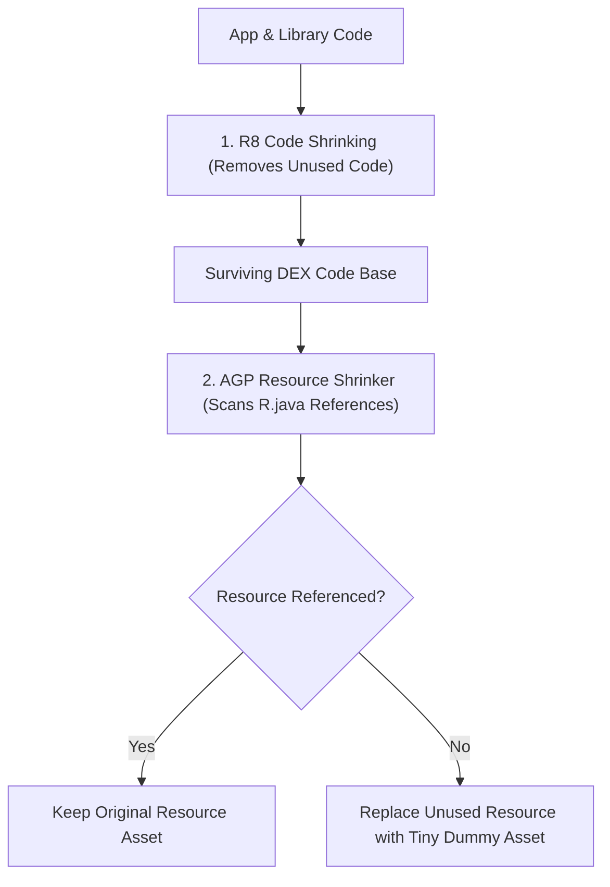

## Resource shrinking은 코드 수축 이후 미사용 리소스를 제거한다

상위 문서: [빌드 최적화 계약](build-optimization.md)

### 개념 및 필요성 (What & Why)
**Resource Shrinking(리소스 수축 - `isShrinkResources = true`)** 은 AGP 빌드 파이프라인에서 참조되지 않는 XML 레이아웃, 이미지, 드로어블 아셋 등의 미사용 리소스를 제거하는 최적화 프로세스이다.
중요한 점은 **Resource Shrinking이 반드시 R8 Code Shrinking 이후에 실행되어야만 안전하게 작동한다**는 사실이다.
코드 수축 단계에서 특정 라이브러리나 기능이 완전히 제거되어야만 그 코드가 참조하던 전용 이미지나 XML 리소스 역시 비참조 상태로 전환되기 때문이다.

### 내부 메커니즘 (Internal Mechanism)
1. **R8 도달 가능성 그래프 연동**: R8 코드 수축이 완료된 직후, AGP Resource Shrinker는 살아남은 DEX 바이트코드의 `R.drawable.*`, `R.layout.*` 참조 도메인을 전수 스캔한다.
2. **미사용 리소스 더미화(Dummy Replacement)**: 완전 삭제 시 AAPT2 테이블 인덱스가 파괴될 수 있는 고위험 리소스의 경우, 리소스 파일 바이너리를 아주 작은 더미(Dummy XML/1x1 픽셀 이미지)로 대체하여 용량을 극소화한다.
3. **`res/raw/keep.xml` 통한 명시적 유지**: `Resources.getIdentifier()` 등 동적 자바 리플렉션으로 리소스를 검색하는 경우, Resource Shrinker가 이를 미사용 리소스로 오진 삭제하는 것을 방지하기 위해 `keep.xml` 파일로 엄격히 관리한다.



### 코드 예시 (build.gradle.kts & res/raw/keep.xml)
```kotlin
// app/build.gradle.kts
android {
    buildTypes {
        getByName("release") {
            isMinifyEnabled = true    // 1. R8 코드 수축 필수
            isShrinkResources = true  // 2. 리소스 수축 활성화
        }
    }
}
```

```xml
<!-- app/src/main/res/raw/keep.xml -->
<resources xmlns:tools="http://schemas.android.com/tools"
    tools:keep="@drawable/dynamic_icon_*"
    tools:discard="@layout/deprecated_layout" />
```

### 관측 가능 증거 (Observable Evidence)
제거되거나 더미화된 리소스 리포트는 빌드 후 출력 로그에서 확인할 수 있다:
```bash
cat build/outputs/mapping/release/resources.txt | grep "Unused resource"
```

관련 노트: [R8은 릴리즈 코드의 수축, 최적화, 난독화를 수행한다](r8-shrinks-optimizes-and-obfuscates-release-builds.md), [빌드 최적화 계약](build-optimization.md)
