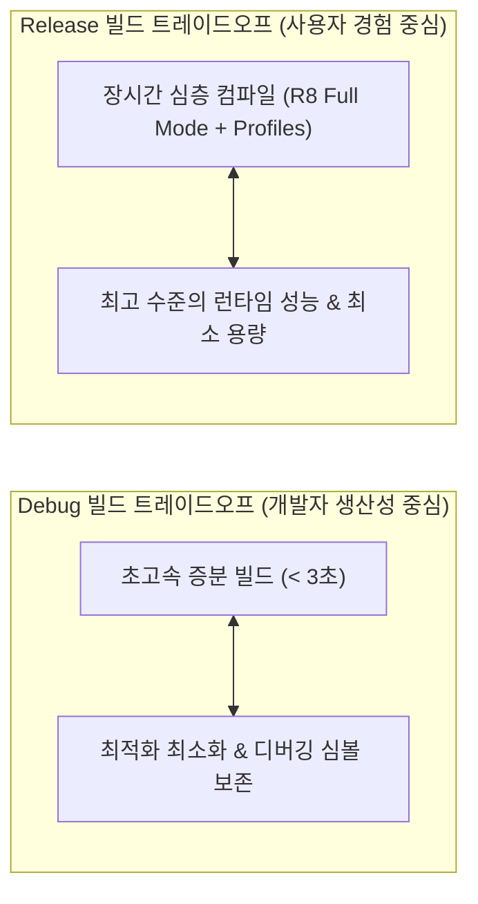

## 빌드 성능과 런타임 성능의 트레이드오프 (Build vs Runtime Performance)

### 개요

Android 엔지니어링에서 **Gradle 빌드 성능(Build Performance - 개발자 머신 또는 CI 에서 컴파일 완료까지 걸리는 시간)** 과 **앱 런타임 성능(App Runtime Performance - 실제 사용자의 스마트폰에서 앱이 기동되고 60/120fps 프레임을 유지하는 속도 및 메모리/배터리 효율)** 은 종종 서로 상충하는 **트레이드오프(Trade-off)** 관계를 가진다.

예를 들어, 모든 빌드에서 R8 코드 수축, 메서드 인라이닝, Baseline Profiles 컴파일을 수행하면 앱 런타임 속도는 극대화되지만 개발 루프(수정 ➔ 빌드 ➔ 테스트)가 수십 초 이상 지연된다. 반대로 빌드 속도를 위해 모든 최적화를 끄면 사용자 환경에서 앱 실행 지연과 프레임 드랍이 발생한다.

따라서 **빌드 환경(Debug vs Release)별로 달성해야 할 최적화 목표를 엄격히 분리**해야 한다.



---

### 1. 빌드 타임 vs 런타임 최적화 매트릭스

| 최적화 기법 | 빌드 타임 영향 | 런타임 영향 | 적용 권장 환경 |
|---|---|---|---|
| **D8 증분 덱싱 (Incremental Dexing)** | ⚡ **극도로 빠름 (수초 이내)** | ➖ 최적화 없음 (바이트코드 원본 보존) | **Debug 빌드** |
| **R8 Full Mode (코드 수축 & 인라이닝)** | ⏳ **느림 (전체 호출 그래프 분석)** | 🚀 **DEX 용량 최대 50% 절감, 빠른 클래스 로딩** | **Release 빌드** |
| **Baseline Profiles (사전 AOT 컴파일)** | ⏳ **빌드 및 CI 시간 소폭 증가** | 🚀 **콜드 스타트 속도 최대 30~40% 단축** | **Release 빌드** |
| **Resource Shrinking (미사용 리소스 제거)** | ⏳ **AAPT2 및 리소스 스캔 시간 추가** | 🚀 **APK 다운로드 용량 대폭 절감** | **Release 빌드** |

---

### 2. 빌드 스크립트 분리 패턴 (`build.gradle.kts`)

```kotlin
// app/build.gradle.kts
android {
    buildTypes {
        getByName("debug") {
            // [Debug] 개발자 피드백 루프 극대화
            isMinifyEnabled = false
            isShrinkResources = false
            isDebuggable = true
        }
        getByName("release") {
            // [Release] 사용자 런타임 성능 및 용량 극대화
            isMinifyEnabled = true
            isShrinkResources = true
            isDebuggable = false
            proguardFiles(
                getDefaultProguardFile("proguard-android-optimize.txt"),
                "proguard-rules.pro"
            )
        }
    }
}
```

---

### 3. 관측 가능 증거 (Observable Evidence)

Gradle 빌드 소요 시간 및 단계별 병목은 프로파일링 명령어로 측정할 수 있다:

```bash
# 1. 로컬 빌드 프로파일 리포트 생성 (build/reports/profile/profile-*.html)
./gradlew :app:assembleDebug --profile

# 2. 클라우드 정밀 진단 Gradle Build Scan 발행
./gradlew :app:assembleRelease --scan
```

---

### 상위 및 연관 문서

- [빌드 최적화 계약](build-optimization.md)
- [Gradle 캐싱 및 빌드 최적화](../build/gradle/gradle-caching-and-optimization.md)
- [D8과 R8 컴파일러 및 덱싱(Dexing) 메커니즘](d8-and-r8.md)
- [AGP Build Variant 아키텍처 및 변형 매트릭스](../build/gradle/agp-build-variants.md)
