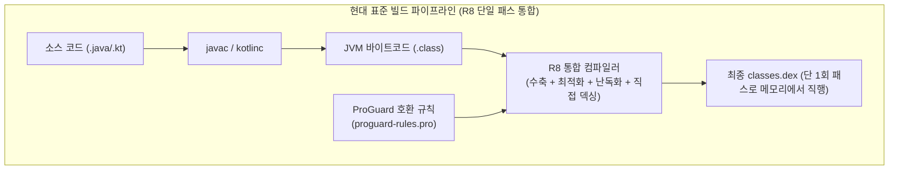
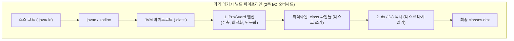

## ProGuard 의 본질과 R8 과의 관계

### 개요

**ProGuard(프로가드)** 는 2002 년 Eric Lafortune(Guardsquare 사)이 개발한 **오픈소스 범용 Java 바이트코드(`.class` ➔ `.class`) 수축(Shrinking), 최적화(Optimization), 난독화(Obfuscation) 독립 도구**이다.

초기 Android SDK 시절 모바일 기기의 극심한 메모리·저장용량 제약과 손쉬운 역공학(디컴파일) 취약점을 해결하기 위해 표준 빌드 툴체인에 도입되었으며, 현재는 Google 이 이를 단일 패스 컴파일러로 재설계한 **[R8](d8-and-r8.md)** 로 대체되었다.

그러나 ProGuard 가 확립한 **규칙 문법(`proguard-rules.pro`)** 과 최적화 개념은 오늘날 Android 빌드 시스템의 표준 규격으로 그대로 계승되어 사용되고 있다.





---

### 1. ProGuard 가 수행하던 4 대 핵심 작업

ProGuard 는 표준 Java 바이트코드(`.class`)를 입력받아 다음 4 단계를 거쳐 새로운 바이트코드(`.class`)를 출력했다:

1. **수축 (Shrinking / Tree Shaking)**:
   - 애플리케이션 진입점(Main 메서드, Activity 등)부터 정적 호출 그래프를 탐색하여, 도달할 수 없는 미사용 클래스, 필드, 메서드를 제거.
2. **최적화 (Optimization)**:
   - 메서드 인라이닝(Inlining), 미사용 매개변수 제거, 분기문 단순화, 상수 폴딩(Constant Folding) 등 바이트코드 수준의 성능 개선.
3. **난독화 (Obfuscation)**:
   - 클래스, 필드, 메서드 이름을 의미를 알 수 없는 짧은 식별자(`a`, `b`, `c`, `a.a.a` 등)로 치환하여 바이트코드 역공학(JADX, APKTool 디컴파일)을 방어하고 파일 크기 축소.
4. **사전 검증 (Preverification)**:
   - Java 6+ JVM 사양에 맞추어 `StackMapTable` 어노테이션을 검증 및 갱신.

---

### 2. 왜 Google 은 ProGuard 를 버리고 R8 을 만들었는가?

Android 생태계가 성장함에 따라 기존 ProGuard 체계의 구조적 한계가 드러났다:

| 비교 항목 | 과거 ProGuard + D8 체계 | 현대 R8 단일 패스(Single-pass) 체계 |
|---|---|---|
| **파이프라인 구조** | 2 단계 분리 (`.class` ➔ **ProGuard** ➔ `.class` ➔ **D8** ➔ `.dex`) | **단일 통합 (`.class` ➔ R8 ➔ `.dex`)** |
| **디스크 I/O 오버헤드** | 중간 최적화 `.class` 파일 수천 개를 쓰고 다시 읽는 극심한 병목 | 중간 파일 생성 없이 **메모리 상에서 직접 `.dex` 생성** |
| **최적화 관점의 한계** | JVM 스택 기반 바이트코드(`.class`) 관점으로만 최적화 | **Android ART 레지스터 기반 런타임 특성에 맞춘 직접 최적화** |
| **빌드 속도 & 메모리** | 느린 빌드 속도, 높은 JVM 힙 메모리 소모 | **빌드 시간 대폭 단축 (최대 30~50% 빠름)** |

---

### 3. 오늘날 왜 여전히 `proguard-rules.pro` 라는 이름을 쓰는가?

Google 이 ProGuard 를 대체하는 R8 을 개발할 때 가장 중요하게 고려한 것은 **"생태계의 하위 호환성(Drop-in Replacement)"** 이었다.

- 전 세계의 수많은 오픈소스 라이브러리(Retrofit, OkHttp, Gson, Coroutines 등)의 `.aar` 아티팩트 내부에는 이미 수년간 작성된 **ProGuard 규칙(`proguard.txt`)** 이 내장되어 있었다.
- Google 은 개발자와 라이브러리 제작자들이 설정을 다시 작성할 필요가 없도록, **R8 이 ProGuard 의 문법 지시어(`-keep`, `-dontwarn`, `-assumenosideeffects` 등)를 100% 호환하여 파싱**하도록 설계했다.
- 이로 인해 오늘날 실제 구동 엔진은 Google 의 R8 이지만, 설정 파일 이름은 여전히 `proguard-rules.pro`이며 DSL 메서드명도 `getDefaultProguardFile("proguard-android-optimize.txt")` 를 그대로 유지하고 있다.

---

### 4. ProGuard Keep 규칙의 핵심 디렉티브

R8 이나 ProGuard 는 리플렉션(Reflection)이나 JNI 네이티브 호출, JSON 직렬화 필드처럼 **컴파일 타임 정적 그래프에 드러나지 않는 동적 코드**를 미사용으로 오판하여 삭제할 위험이 있다. 이를 방어하는 규칙이 **Keep 규칙**이다:

```proguard
# 1. 클래스와 모든 멤버를 수축/난독화에서 완전 보호
-keep class com.example.myapp.MyCriticalService { *; }

# 2. 클래스 이름은 난독화하되, 리플렉션/직렬화 대상 필드만 보호
-keepclassmembers class com.example.myapp.data.dto.** {
    <fields>;
}

# 3. 특정 어노테이션이 붙은 클래스 멤버 보호
-keepclassmembers class * {
    @androidx.annotation.Keep <methods>;
}

# 4. 사용되지 않는 서드파티 라이브러리 누락 클래스에 대한 경고 무시
-dontwarn okhttp3.internal.platform.**
```

---

### 상위 및 연관 문서

- [D8과 R8 컴파일러 및 덱싱(Dexing) 메커니즘](d8-and-r8.md)
- [R8 Keep 규칙과 최적화 경계](r8-keep-rules.md)
- [Android 빌드 파이프라인과 핵심 빌드 용어 해설](../build/gradle/android-build-pipeline.md)
- [AGP 릴리스 빌드 점검 체크리스트](../build/gradle/agp-release-checklist.md)
- [바이트코드 파일(.class)과 아카이브 파일(.jar)의 본질](../../../../computer-science/jvm-bytecode-and-jar-archive.md)
