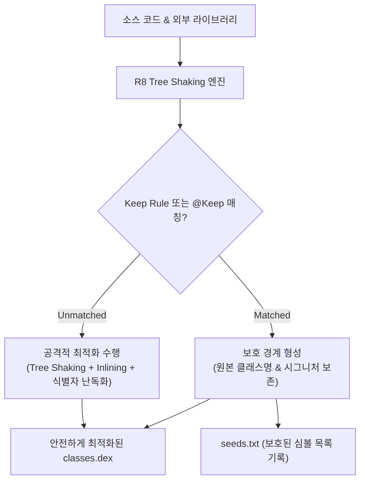

## R8 Keep 규칙과 최적화 경계 (Keep Rules & Optimization Boundaries)

### 개요

**R8 Keep 규칙(`proguard-rules.pro`)** 은 R8 최적화 컴파일러 엔진에게 특정 클래스, 메서드, 필드에 대해 코드 수축(Shrinking), 최적화(Optimization), 난독화(Obfuscation)를 적용하지 않도록 지정하는 **최적화 보호 경계(Optimization Boundaries)** 이다.

R8 은 컴파일 시점의 정적 호출 그래프(Static Call Graph)만을 추적하므로, 런타임 리플렉션(Reflection), JNI 네이티브 C/C++ 바인딩, JSON DTO 직렬화 필드 등 정적으로 식별되지 않는 동적 코드를 '미사용 코드'로 오판하여 삭제할 위험이 있다. 정확한 Keep 규칙은 이러한 런타임 릴리스 크래시(`ClassNotFoundException`, `NoSuchMethodError`, `NullPointerException`)를 원천 차단한다.



---

### 1. 주요 Keep 규칙 지시어 4 종 비교

| 규칙 디렉티브 | 클래스 이름 난독화 여부 | 클래스 멤버(필드/메서드) 보호 여부 | 주요 사용 대상 |
|---|---|---|---|
| **`-keep`** | ❌ **난독화 안 됨 (보존)** | ❌ **모든 멤버 보존 (수축/난독화 차단)** | AndroidManifest 컴포넌트, JNI 진입 클래스 |
| **`-keepclassmembers`** | ⭕ **난독화 됨 (클래스명 변경)** | ❌ **지정된 멤버만 원본 이름 보존** | Gson/Retrofit DTO 필드, View 생성자 |
| **`-keepclasseswithmembers`** | ❌ **조건 만족 시 보존** | ❌ **조건에 명시된 멤버 보존** | `native` 메서드를 포함하는 모든 클래스 |
| **`@Keep` 어노테이션** | ❌ **어노테이션 대상 보존** | ❌ **어노테이션 대상 보존** | 소스 코드 내 국소적 단일 클래스/메서드 |

---

### 2. 핵심 실무 패턴별 Keep 규칙 예시

#### 1) DTO 및 JSON 직렬화 객체 (Gson / Jackson / Moshi)

리플렉션으로 필드명에 접근하는 DTO 클래스는 필드명이 `a`, `b`로 난독화되면 JSON 파싱 결과가 모두 `null` 이 된다:

```proguard
# 클래스명은 난독화(a, b)를 허용하되, 내부 직렬화 필드만 보존
-keepclassmembers class com.example.myapp.data.dto.** {
    <fields>;
}
```

#### 2) JNI 네이티브 C/C++ 연동 메서드

C/C++ 네이티브 코드에서 Java 메서드를 찾을 때 사용하는 `Java_com_example_…` 시그니처가 깨지지 않도록 보호:

```proguard
# native 메서드를 하나라도 가진 클래스와 해당 native 메서드 시그니처 보존
-keepclasseswithmembernames class * {
    native <methods>;
}
```

#### 3) XML 레이아웃 커스텀 뷰 (Custom View)

`LayoutInflater` 가 런타임 리플렉션으로 2 인자 생성자를 호출하므로 보존 필수:

```proguard
-keepclassmembers class * extends android.view.View {
    public <init>(android.content.Context, android.util.AttributeSet);
    public <init>(android.content.Context, android.util.AttributeSet, int);
}
```

#### 4) `@Keep` 어노테이션 활용 (`androidx.annotation.Keep`)

별도의 `proguard-rules.pro` 파일을 수정하지 않고 코드 수준에서 직접 경계를 지정:

```kotlin
import androidx.annotation.Keep

@Keep
data class PaymentResponse(
    val transactionId: String,
    val amount: Long
)
```

---

### 3. Keep 규칙 작성 시 주의사항과 안티패턴

1. **과도한 와일드카드 사용 금지 (`-keep class com.example.** { *; }`)**:
   - 패키지 전체를 무분별하게 `-keep` 하면 R8 의 코드 수축률이 급감하고 APK 용량이 폭증한다.
2. **`-dontwarn` 지시어의 올바른 사용**:
   - `-dontwarn` 은 컴파일 시점에 존재하지 않는 클래스 참조에 대한 경고를 억제하는 옵션이다.
   - 런타임에 실제로 호출되지 않는 선택적 서드파티 의존성에만 한정하여 사용해야 하며, 실제 누락된 필수 라이브러리를 숨기는 용도로 남용하면 안 된다.

---

### 4. 관측 가능 증거 (Observable Evidence)

R8 이 Keep 규칙을 올바르게 인지하고 보호했는지는 `seeds.txt` 리포트로 즉시 검증할 수 있다:

```bash
# 1. 특정 DTO 클래스가 R8에 의해 보호되었는지 seeds.txt에서 확인
cat app/build/outputs/mapping/release/seeds.txt | grep "com.example.myapp.data.dto"

# 2. 최종 APK 바이너리에서 해당 클래스 메서드 난독화 상태 검증 (apkanalyzer)
apkanalyzer dex packages app/build/outputs/apk/release/app-release.apk | grep "com.example.myapp"
```

---

### 상위 및 연관 문서

- [ProGuard의 본질과 R8과의 관계](proguard.md)
- [D8과 R8 컴파일러 및 덱싱(Dexing) 메커니즘](d8-and-r8.md)
- [R8 리소스 수축(Resource Shrinking)](r8-resource-shrinking.md)
- [R8 Full Mode와 Configuration Analyzer](r8-full-mode.md)
- [R8 릴리스 검증 및 De-obfuscation](r8-validation.md)
- [빌드 최적화 계약](build-optimization.md)
