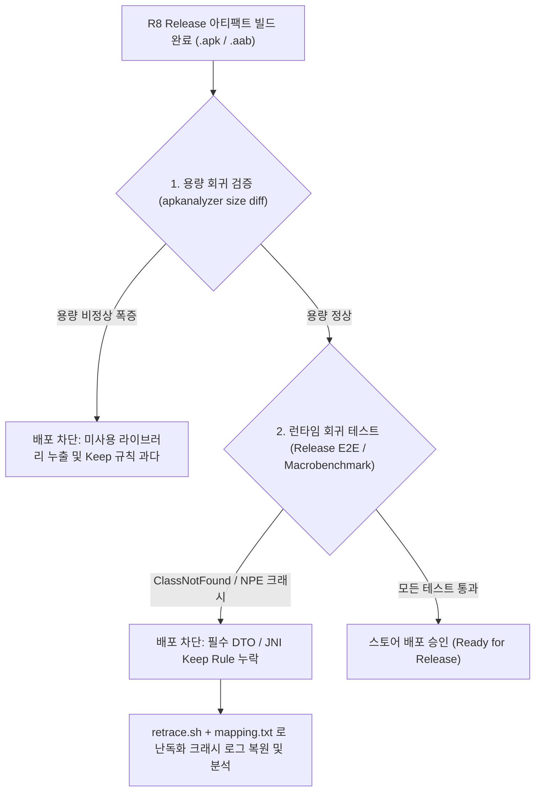

## R8 릴리스 검증과 De-obfuscation (R8 Output Validation & Retrace)

### 개요

R8 최적화 컴파일러가 적용된 빌드가 컴파일 에러 없이 성공했다고 해서 안전한 릴리스가 보장되는 것은 아니다.

디버그 빌드에서는 정상 작동하던 앱이 R8 의 코드 수축 및 식별자 난독화 이후, 런타임에 리플렉션 오류(`ClassNotFoundException`, `NoSuchFieldException`), 직렬화 데이터 누락(`NullPointerException`), 또는 예기치 않은 서드파티 라이브러리 번들링으로 인한 APK 용량 폭증을 유발할 수 있다.

따라서 **R8 산출물은 반드시 용량 회귀 감사(Size Diff Audit)와 런타임 계측 회귀 테스트(Runtime Regression Test)로 2 중 검증**되어야 한다.



---

### 1. 2 대 핵심 검증 관문

#### 1) 용량 회귀 감사 (Size Diff Audit)

- 이전 릴리스 아티팩트 대비 `DEX`, `res`, `assets`, `lib(.so)` 디렉터리의 바이트 단위 증감률을 분석한다.
- 불필요한 서드파티 라이브러리나 디버그 전용 코드가 R8 에 의해 걸러지지 않고 유입되었는지를 사전에 감지한다.

#### 2) 런타임 계측 회귀 테스트 (Release Variant E2E)

- R8 이 적용된 실제 릴리스 아티팩트로 자동화 E2E 테스트 및 Macrobenchmark 를 실행한다.
- 리플렉션 기반 직렬화(Gson/Moshi/Retrofit), JNI C/C++ 네이티브 연동, 커스텀 뷰 XML 인플레이션이 정상 동작하는지 검증한다.

---

### 2. 난독화 스택 트레이스 복원 (`retrace`)

R8 이 활성화된 릴리스 앱에서 크래시가 발생하면 클래스와 메서드명이 `a.b.c(Source:12)` 형태로 난독화되어 출력된다. Android SDK 의 **`retrace` 도구**와 빌드 시 생성된 **`mapping.txt`** 를 사용하여 원본 소스 라인으로 복원할 수 있다.

```bash
# Android Command-line Tools의 retrace 실행
retrace app/build/outputs/mapping/release/mapping.txt obfuscated_trace.txt
```

>[!IMPORTANT]
>`mapping.txt` 파일은 각 빌드마다 고유하게 생성되는 암호 해독 키와 같다. 배포된 특정 버전의 `mapping.txt` 를 분실하면 해당 버전에서 발생한 사용자 크래시 로그를 영원히 복원할 수 없으므로, CI 파이프라인에서 아티팩트 저장소에 영구 아카이빙하거나 Google Play Console / Crashlytics 에 자동 업로드해야 한다.

---

### 3. 관측 가능 증거 (Observable Evidence)

```bash
# 1. APK 요약 정보 및 총 용량 메트릭 추출
apkanalyzer apk summary app/build/outputs/apk/release/app-release.apk

# 2. DEX 파일 내 패키지/클래스별 용량 및 메서드 수 분석
apkanalyzer dex packages app/build/outputs/apk/release/app-release.apk

# 3. 두 APK 버전 간의 상세 용량 차이(Diff) 분석
apkanalyzer apk compare app-old.apk app-new.apk
```

---

### 상위 및 연관 문서

- [D8과 R8 컴파일러 및 덱싱(Dexing) 메커니즘](d8-and-r8.md)
- [R8 Keep 규칙과 최적화 경계](r8-keep-rules.md)
- [AGP 릴리스 빌드 점검 체크리스트](../build/gradle/agp-release-checklist.md)
- [빌드 최적화 계약](build-optimization.md)
